# Course outline

# Running R


## Running R online

Go to [rstudio.cloud](https://rstudio.cloud).


- Click Get Started (or Sign Up top right).
 
## Signing up
  

{height=200px}


-  Fill out the top 4 boxes and click Sign Up. Or, log in with your
  Google or Github accounts, if you have either of those. (If you have
  GMail, that's a Google account.)


## Logging in

- After you have signed up, you will be logged in.
- If you close the rstudio.cloud browser tab and open it up again,
you will probably get automatically logged in.
- If not, you can click Log In on the opening screen, or click Get
Started and pretend to sign up again, and you’ll get logged in.
- You can explicitly log out, in which case you’ll need to log in again.
- Use one of these ways to get back into R Studio Cloud next time.


## R Studio Cloud

{height=200px}

- Each user has a “workspace”, which is a place where all your work is
stored.
- Within that workspace, you can have as many Projects as you like.
- To create a new Project, click on the blue New Project button.

## In a new project
  
-   R Studio starts a new (untitled) project:
    
{height=180px}     

  - In left-hand Console can type stuff and see output.
  - Click on Console, type \texttt{install.packages("tidyverse")}
    and let it do what it will. (This takes a few minutes.)


## R Notebooks

- At left of previous view is Console, where you can enter R commands
and see output.
- A better way to work is via “R Notebooks”. These allow you to
combine narrative, code and output in one document.
- Data analysis is always a story: not only what you did, but why you
did it, with the “why” being more important.
- To create a new notebook, select File, New File, R Notebook. This
brings up an example notebook as over.
- The first time, you will probably be asked to “install some packages”.
Click Yes to let it do that.

## The template R Notebook
  


## About this notebook

- The notebook begins with a title (that you can change).
- Most of this notebook is text (narrative). The stuff with
`*asterisks*` around it will come out in italics in the final document.
- Pieces beginning with ````{r}`, in grey, are called code chunks. They
contain R code. ````` marks the end of a code chunk.
- Run code chunks by clicking on the green “play button” at the top
right of the chunk. This one makes a scatterplot. If you click the play
button, the plot is made and placed under the code, as over.

## After running the code chunk
  
  
  
## Making our own notebook

- Create another new notebook. Delete the template text and change
the title to “Some random normal data”.
- Type `## Packages` and go down a couple of lines.
- Make a new code chunk by clicking Insert (at the top of the notebook
window) and selecting R. Inside that chunk, type
`library(tidyverse)`.
- Below that, type `## Random normal data`.
- Make another new code chunk below that, and insert two lines of
code: `z=rnorm(100)` and then `z`.
- Below that, type text `## A histogram` and a code chunk containing
`ggplot(tibble(z),aes(x=z))+geom_histogram(bins=10)`.

## My R notebook


  
## Run the chunks

- Now run each of the three chunks in order. You’ll see output below
each one, including a histogram below the last one.
- When it works, add some narrative text before the code chunks
explaining what is going to be done, and some text after describing
what you see.
- Save the notebook (File, Save As). You don’t need a file extension.
- Click Preview. This makes an HTML-formatted report. (The first
may be gibberish: ignore that). Note what happened to the text.
- If you want to edit anything, go back to the R Notebook, change it,
save it, and run Preview again.

## The end of my report


## Installing R on your own computer

- Free, open-source. Download and run on own computer.
- Two things: R itself (install first) and R Studio (front end).
- Go to <https://www.r-project.org/>:


## Click on Download

- R is stored on numerous “mirrors”, sites around the world. The top
one, “0-Cloud”, picks one for you. Or you can choose one close to
you (might be faster), eg. U of T:


...


## Click your mirror

- Click 0-Cloud or U of T (or other mirror), get:


- Click on your operating system, eg. Windows.

## Click on Base


- Click on “base” here.

## The actual download

- Click the top link below:


- Then install usual way.
- Or, for Mac, download and install `R-3-5-1.pkg`.
- Or, for Linux, click your distribution (eg. Ubuntu), then one of the
cran35 links according to your version, then probably
`r-base-core_3.5.1-1bionic_amd64.deb`.

## Now, R Studio

- Go [here](https://www.rstudio.com/).
- Find this, and click Download:

{height=200px}


## Scroll down...

- to this:


- Click left-side Download.

## Find the one for you

- Scroll down, and click the installer for your machine
    (Windows, Mac, 5 flavours of Linux). Install as usual.
    


## Running R

- All of above only done once.
- To run R, run R Studio, which itself runs R.


## How R Studio looks when you run it

{height=200px}

- First time you run R Studio, click on Console window, and, next to the
`>`, type `install.packages("tidyverse")`. Let it do
what it needs to.

## Projects

- A project is a “container” for code and data that belong together.
- Goes with a folder on some computer.
- File, New Project. You have option to create the new project in a
new folder, or in a folder that already exists.
- Use a project for a collection of work that belongs together, eg. data
files and notebooks for assignments. Putting everything in a project
folder makes it easier to find.
- Example: use a project for (all) assignments, a different notebook
within that project for each one.


# Reading in data


## Introduction

- First thing we need to do is to read in data, so that we can use our
software to analyze.
- Consider these:
  - Spreadsheet data saved as `.csv` file.
  - “Delimited” data such as values separated by spaces.
  - Actual Excel spreadsheets.

## A spreadsheet


## Save as `.csv`

- `.csv` or “comma-separated values” is a way of turning spreadsheet
values into plain text.
- Easy to read into R (or SAS, later)
- but does not preserve formulas. (This is a reason for doing all your
calculations in your statistical software, and only having data in your
spreadsheet.)
- File, Save As Text CSV (or similar). 
- used name `test1.csv`.


## The `.csv` file

```
id,x,y,group
p1,10,21,upper
p2,11,20,lower
p3,13,25,upper
p4,15,27,lower
p5,16,30,upper
p6,17,31,lower
```


To read this in:

- Fire up rstudio.cloud.
- Upload this .csv file. (Bottom right, next to New Folder, Upload.)
Click Choose File, find the file, click Open. Click OK. See the file
appear bottom right.

## Make a new notebook


- ...and get rid of the template document (leaving the first four lines).
- Make a code chunk and in it put this. Run it.


```r
library(tidyverse)
```

```
## ── Attaching packages ────────────── tidyverse 1.2.1 ──
```

```
## ✔ ggplot2 3.1.1          ✔ purrr   0.3.2     
## ✔ tibble  2.1.1          ✔ dplyr   0.8.0.1   
## ✔ tidyr   0.8.3.9000     ✔ stringr 1.4.0     
## ✔ readr   1.3.1          ✔ forcats 0.3.0
```

```
## Warning: package 'ggplot2' was built under R version
## 3.5.3
```

```
## Warning: package 'tibble' was built under R version
## 3.5.3
```

```
## Warning: package 'tidyr' was built under R version
## 3.5.3
```

```
## Warning: package 'readr' was built under R version
## 3.5.2
```

```
## Warning: package 'purrr' was built under R version
## 3.5.3
```

```
## Warning: package 'dplyr' was built under R version
## 3.5.2
```

```
## Warning: package 'stringr' was built under R version
## 3.5.2
```

```
## Warning: package 'forcats' was built under R version
## 3.5.1
```

```
## ── Conflicts ───────────────── tidyverse_conflicts() ──
## ✖ dplyr::filter() masks stats::filter()
## ✖ dplyr::lag()    masks stats::lag()
```

## Reading in the file

- Use read_csv with the name of the file, in quotes. Save the read-in
file in something, here called mydata. Make a new code chunk for
this:


```r
mydata=read_csv("test1.csv")
```

```
## Parsed with column specification:
## cols(
##   id = col_character(),
##   x = col_double(),
##   y = col_double(),
##   group = col_character()
## )
```

## More on the above

- read_csv guesses what kind of thing is in each column. Here it
correctly guesses that:
- id and group are text (categorical variables). id is actually “identifier
variable”: identifies individuals.
- x and y are integers (quantitative variables that here have no decimal
point). Decimal numbers would be labelled num or double.

## R Studio on your own computer

- Put the .csv file in the same folder as your project. Then read it in
as above like `read_csv("test1.csv")`.
- Or, use
`f=file.choose()`
which brings up a file selector (as if you were going to find a file to
load or save it). Find your `.csv` file, the address of which will be
saved in `f`, and then:
```
mydata=read_csv(f)
```

- When you have selected the file, comment out the `file.choose` line
by putting a # on the front of it. That will save you having to find
the file again by mistake. (Keyboard shortcut: go to the line, type
control-shift-C or Mac equivalent with Cmd.)

## Looking at what we read in
- Again, type the name of the thing to display it:


```r
mydata
```

```
## # A tibble: 6 x 4
##   id        x     y group
##   <chr> <dbl> <dbl> <chr>
## 1 p1       10    21 upper
## 2 p2       11    20 lower
## 3 p3       13    25 upper
## 4 p4       15    27 lower
## 5 p5       16    30 upper
## 6 p6       17    31 lower
```

- This is a “tibble” or data frame, the standard way of storing a data
set in R.
- Tibbles print as much as will display on the screen. If there are more
rows or columns, it will say so.
- You will see navigation keys to display more rows or columns (if there are more).

## `View`-ing your data frame

- Another way to examine your data frame is to View it, like this:


```r
View(mydata)
```

...or find your data frame in the Global Environment top right and
click it.
- This pops up a “data frame viewer” top left:

{height=180px}

## This View

- Read-only: cannot edit data
- Can display data satisfying conditions: click on Filter, then:
- for a categorical variable, type name of category you want
- for a quantitative variable, use slider to describe values you want.
- Can sort a column into ascending or descending order (click little
arrows next to column name).
- Clicking the symbol with arrow on it left of Filter “pops out” View
into separate (bigger) window.

## Summarizing what we read in

- It is always a good idea to look at your data after you have read it in,
to make sure you have believable numbers (and the right number of
individuals and variables).
- Five-number summary:


```r
summary(mydata)
```

```
##       id                  x               y        
##  Length:6           Min.   :10.00   Min.   :20.00  
##  Class :character   1st Qu.:11.50   1st Qu.:22.00  
##  Mode  :character   Median :14.00   Median :26.00  
##                     Mean   :13.67   Mean   :25.67  
##                     3rd Qu.:15.75   3rd Qu.:29.25  
##                     Max.   :17.00   Max.   :31.00  
##     group          
##  Length:6          
##  Class :character  
##  Mode  :character  
##                    
##                    
## 
```

- For quantitative variables, a five-number summary plus the mean.
- For categorical variables, count of how many rows.
- Quick check for errors: these often show up as values too high or too
low, so the min and/or max will be unreasonable.

## Reading from a URL
- Any data file on the Web can be read directly.
- [Example data:](http://www.utsc.utoronto.ca/~butler/c32/global.csv).
- Use URL instead of filename.
- I like to save the URL in a variable first (because URLs tend to be
long), and then put that variable in the read_ function:


```r
my_url="http://www.utsc.utoronto.ca/~butler/c32/global.csv"
global=read_csv(my_url)
```

```
## Parsed with column specification:
## cols(
##   warehouse = col_character(),
##   size = col_double(),
##   cost = col_double()
## )
```

## The data


```r
global
```

```
## # A tibble: 10 x 3
##    warehouse  size  cost
##    <chr>     <dbl> <dbl>
##  1 A           225 12.0 
##  2 B           350 14.1 
##  3 A           150  8.93
##  4 A           200 11.0 
##  5 A           175 10.0 
##  6 A           180 10.1 
##  7 B           325 13.8 
##  8 B           290 13.3 
##  9 B           400 15   
## 10 A           125  7.97
```

## Space-delimited files

- Another common format for data is a text file with the values
separated by spaces. Top of some other data:

```
cup tempdiff      	    
Starbucks 13   	  	    
Starbucks 7    	   
Starbucks 7    	   
Starbucks 17.5 	   
Starbucks 10   	   
Starbucks 15.5 	   
Starbucks 6    	   
Starbucks 6    	   
SIGG 12	       	   
SIGG 16	       	   
SIGG 9	       	   
SIGG 23	       	   
SIGG 11	       	   
SIGG 20.5      	   
SIGG 12.5      
SIGG 20.5      
SIGG 24.5      
CUPPS 6    
CUPPS 6    
CUPPS 18.5 
CUPPS 10   
```


## Reading the coffee data

- This file was on my computer so I uploaded it to <http://rstudio.cloud>
first.
- This time, read_delim, and we also have to say what the thing is
separating the values:


```r
coffee=read_delim("coffee.txt"," ")
```

```
## Parsed with column specification:
## cols(
##   cup = col_character(),
##   tempdiff = col_double()
## )
```

- Name of the cup, text, and tempdiff, a decimal number.

## Looking at the values (some)


```r
coffee
```

```
## # A tibble: 32 x 2
##    cup       tempdiff
##    <chr>        <dbl>
##  1 Starbucks     13  
##  2 Starbucks      7  
##  3 Starbucks      7  
##  4 Starbucks     17.5
##  5 Starbucks     10  
##  6 Starbucks     15.5
##  7 Starbucks      6  
##  8 Starbucks      6  
##  9 SIGG          12  
## 10 SIGG          16  
## # … with 22 more rows
```

These were four brands of travel mug (in cup), and for each, how much
the temperature of the coffee in the mug decreased over 30 minutes.

## Reading from the Web; the soap data
- Use the URL in place of the filename.
- Save the URL in a variable first:


```r
url="http://www.utsc.utoronto.ca/~butler/c32/soap.txt"
soap=read_delim(url," ")
```

```
## Parsed with column specification:
## cols(
##   case = col_double(),
##   scrap = col_double(),
##   speed = col_double(),
##   line = col_character()
## )
```

## The soap data (some)


```r
soap
```

```
## # A tibble: 27 x 4
##     case scrap speed line 
##    <dbl> <dbl> <dbl> <chr>
##  1     1   218   100 a    
##  2     2   248   125 a    
##  3     3   360   220 a    
##  4     4   351   205 a    
##  5     5   470   300 a    
##  6     6   394   255 a    
##  7     7   332   225 a    
##  8     8   321   175 a    
##  9     9   410   270 a    
## 10    10   260   170 a    
## # … with 17 more rows
```

## Data aligned in columns
- Sometimes you see data aligned in columns, thus:

{height=180px}

- read_delim will not work: values separated by more than one space.
- The number of spaces between values is not constant, because there
is one fewer space before the 10.
- read_table works for this.

## Reading in column-aligned data


```r
drugs=read_table("migraine.txt")
```

```
## Parsed with column specification:
## cols(
##   DrugA = col_double(),
##   DrugB = col_double(),
##   DrugC = col_double()
## )
```

## The data


```r
drugs
```

```
## # A tibble: 9 x 3
##   DrugA DrugB DrugC
##   <dbl> <dbl> <dbl>
## 1     4     6     6
## 2     5     8     7
## 3     4     4     6
## 4     3     5     6
## 5     2     4     7
## 6     4     6     5
## 7     3     5     6
## 8     4    10     5
## 9     4     6     5
```


## Reading an Excel sheet directly

- Here is my spreadsheet from before, but tarted up a bit:

{height=180px}

- It is now a workbook with a second sheet called “notes” (that we
don’t want).
- Install package readxl first.

## Reading it in

- Read into R, saying that we only want the sheet “data”. Upload
spreadsheet first.
- Excel spreadsheets must be “local”:
cannot read one in from a URL.


```r
library(readxl)
```

```
## Warning: package 'readxl' was built under R version
## 3.5.2
```

```r
mydata2=read_excel("test2.xlsx",sheet="data")
mydata2
```

```
## # A tibble: 6 x 4
##   id        x     y group
##   <chr> <dbl> <dbl> <chr>
## 1 p1       10    21 upper
## 2 p2       11    20 lower
## 3 p3       13    25 upper
## 4 p4       15    27 lower
## 5 p5       16    30 upper
## 6 p6       17    31 lower
```


# Making graphs


## Our data
- To illustrate making graphs, we need some data.
- Data on 202 male and female athletes at the Australian Institute of
Sport.
- Variables:
  - categorical: Sex of athlete, sport they play
  - quantitative: height (cm), weight (kg), lean body mass, red and white
  blood cell counts, haematocrit and haemoglobin (blood), ferritin
  concentration, body mass index, percent body fat.
- Values separated by tabs (which impacts reading in).

## Reading data into R
- Use `read_tsv` (“tab-separated values”), like `read_csv`.
- Data in `ais.txt`:


```r
my_url="http://www.utsc.utoronto.ca/~butler/c32/ais.txt"
athletes=read_tsv(my_url)
```

```
## Parsed with column specification:
## cols(
##   Sex = col_character(),
##   Sport = col_character(),
##   RCC = col_double(),
##   WCC = col_double(),
##   Hc = col_double(),
##   Hg = col_double(),
##   Ferr = col_double(),
##   BMI = col_double(),
##   SSF = col_double(),
##   `%Bfat` = col_double(),
##   LBM = col_double(),
##   Ht = col_double(),
##   Wt = col_double()
## )
```

## The data (some)


```r
athletes
```

```
## # A tibble: 202 x 13
##    Sex    Sport     RCC   WCC    Hc    Hg  Ferr   BMI
##    <chr>  <chr>   <dbl> <dbl> <dbl> <dbl> <dbl> <dbl>
##  1 female Netball  4.56  13.3  42.2  13.6    20  19.2
##  2 female Netball  4.15   6    38    12.7    59  21.2
##  3 female Netball  4.16   7.6  37.5  12.3    22  21.4
##  4 female Netball  4.32   6.4  37.7  12.3    30  21.0
##  5 female Netball  4.06   5.8  38.7  12.8    78  21.8
##  6 female Netball  4.12   6.1  36.6  11.8    21  21.4
##  7 female Netball  4.17   5    37.4  12.7   109  21.5
##  8 female Netball  3.8    6.6  36.5  12.4   102  24.4
##  9 female Netball  3.96   5.5  36.3  12.4    71  22.6
## 10 female Netball  4.44   9.7  41.4  14.1    64  22.8
## # … with 192 more rows, and 5 more variables:
## #   SSF <dbl>, `%Bfat` <dbl>, LBM <dbl>, Ht <dbl>,
## #   Wt <dbl>
```

## Types of graph

Depends on number and type of variables:

  \begin{tabular}{ccp{0.5\textwidth}}
    Categorical & Quantitative & Graph\\
    \hline
    1 & 0 & bar chart\\
    0 & 1 & histogram\\
    2 & 0 & grouped bar charts\\
    1 & 1 & side-by-side boxplots\\
    0 & 2 & scatterplot\\
    2 & 1 & grouped boxplots\\
    1 & 2 & scatterplot with points identified by group (eg.\ by colour)\\
    \hline
  \end{tabular}

With more variables, might want *separate plots by groups*. This is called
`facetting` in R.


## `ggplot`

- R has a standard graphing procedure ggplot, that we use for all our
graphs.
- Use in different ways to get precise graph we want.
- Let’s start with bar chart of the sports played by the athletes.

## Bar chart


```r
ggplot(athletes, aes(x = Sport)) + geom_bar()
```


## Histogram of body mass index


```r
ggplot(athletes,aes(x=BMI))+geom_histogram(bins=10)
```

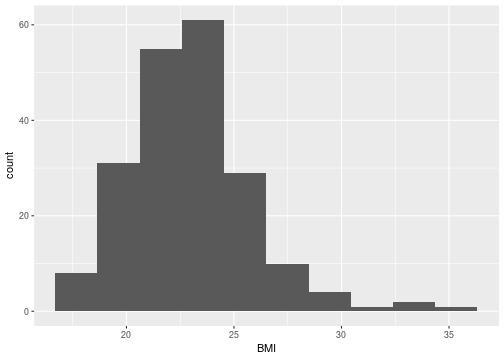

## Which sports are played by males and females?

Grouped bar chart:


```r
ggplot(athletes, aes(x = Sport, fill = Sex)) +
  geom_bar(position = "dodge")
```


## BMI by gender


```r
ggplot(athletes,aes(x=Sex,y=BMI))+geom_boxplot()
```


## Height vs. weight

Scatterplot:


```r
ggplot(athletes,aes(x=Ht,y=Wt))+geom_point()
```

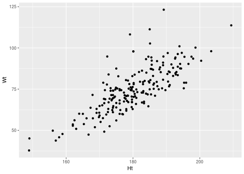

## With regression line


```r
ggplot(athletes,aes(x=Ht,y=Wt))+
  geom_point()+geom_smooth(method="lm")
```


## BMI by sport and gender


```r
ggplot(athletes,aes(x=Sport,y=BMI,colour=Sex))+
geom_boxplot()
```


## Height and weight by gender


```r
ggplot(athletes,aes(x=Ht,y=Wt,colour=Sex))+
  geom_point()
```


## Height by weight for each sport, with facets


```r
ggplot(athletes,aes(x=Ht,y=Wt,colour=Sex))+
geom_point()+facet_wrap(~Sport)
```


## Filling each facet

Default uses same scale for each facet. To use different scales for each
facet, this:


```r
ggplot(athletes,aes(x=Ht,y=Wt,colour=Sex))+
geom_point()+facet_wrap(~Sport,scales="free")
```


# Numerical summaries: more detailed


## Summarizing data in R
- Have seen summary (5-number summary of each column). But what
if we want:
  - a summary or two of just one column
  - a count of observations in each category of a categorical variable
  - summaries by group
  - a different summary of all columns (eg. SD)
- To do this, meet pipe operator `%>%`. This takes input data frame,
does something to it, and outputs result. (Learn: `Ctrl-Shift-M`.) 
- Output from a pipe can be used as input to something else, so can
have a sequence of pipes.
- Summaries include: mean, median, min, max, sd, IQR, quantile (for
obtaining quartiles or any percentile), n (for counting observations).
- Use our Australian athletes data again.

## Summarizing one column
- Mean height: 


```r
athletes %>% summarize(m=mean(Ht))
```

```
## # A tibble: 1 x 1
##       m
##   <dbl>
## 1  180.
```

or to get mean and SD of BMI:


```r
athletes %>% summarize(m=mean(BMI),s=sd(BMI))
```

```
## # A tibble: 1 x 2
##       m     s
##   <dbl> <dbl>
## 1  23.0  2.86
```

## Quartiles

- `quantile` calculates percentiles ("fractiles"), so we want the 25th and 75th
percentiles:


```r
athletes %>% summarize( Q1=quantile(Wt, 0.25),
                        Q3=quantile(Wt, 0.75))
```

```
## # A tibble: 1 x 2
##      Q1    Q3
##   <dbl> <dbl>
## 1  66.5  84.1
```

## Creating new columns

- These weights are in kilograms. Maybe we want to summarize the
weights in pounds.
- Convert kg to lb by multiplying by 2.2.
- Create new column and summarize that: 


```r
athletes %>% mutate(wt_lb=Wt*2.2) %>%
  summarize(Q1_lb=quantile(wt_lb, 0.25),
            Q3_lb=quantile(wt_lb, 0.75))
```

```
## # A tibble: 1 x 2
##   Q1_lb Q3_lb
##   <dbl> <dbl>
## 1  146.  185.
```

## Counting how many
for example, number of athletes in
each sport: 


```r
athletes %>% count(Sport)
```

```
## # A tibble: 10 x 2
##    Sport       n
##    <chr>   <int>
##  1 BBall      25
##  2 Field      19
##  3 Gym         4
##  4 Netball    23
##  5 Row        37
##  6 Swim       22
##  7 T400m      29
##  8 Tennis     11
##  9 TSprnt     15
## 10 WPolo      17
```

## Counting how many, variation 2:

Another way (which will make sense
in a moment):


```r
athletes %>% group_by(Sport) %>%
  summarize(count=n())
```

```
## # A tibble: 10 x 2
##    Sport   count
##    <chr>   <int>
##  1 BBall      25
##  2 Field      19
##  3 Gym         4
##  4 Netball    23
##  5 Row        37
##  6 Swim       22
##  7 T400m      29
##  8 Tennis     11
##  9 TSprnt     15
## 10 WPolo      17
```

## Summaries by group
- Might want separate summaries for each “group”, eg. mean and SD
of height for males and females. Strategy is `group_by` (to define the
groups) and then `summarize`: 


```r
athletes %>% group_by(Sex) %>% 
  summarize(m=mean(Ht), s=sd(Ht))
```

```
## # A tibble: 2 x 3
##   Sex        m     s
##   <chr>  <dbl> <dbl>
## 1 female  175.  8.24
## 2 male    186.  7.90
```

- This explains second variation on counting within group: “within each
sport, how many athletes were there?”

## Summarizing several columns

- Standard deviation of each (numeric) column: 


```r
athletes %>% summarize_if(is.numeric, sd)
```

```
## # A tibble: 1 x 11
##     RCC   WCC    Hc    Hg  Ferr   BMI   SSF `%Bfat`
##   <dbl> <dbl> <dbl> <dbl> <dbl> <dbl> <dbl>   <dbl>
## 1 0.458  1.80  3.66  1.36  47.5  2.86  32.6    6.19
## # … with 3 more variables: LBM <dbl>, Ht <dbl>,
## #   Wt <dbl>
```

- Median and IQR of all columns whose name starts with H: 

```r
athletes %>% summarize_at(vars(starts_with("H")),
                          list(med=median, iqr=IQR))
```

```
## # A tibble: 1 x 6
##   Hc_med Hg_med Ht_med Hc_iqr Hg_iqr Ht_iqr
##    <dbl>  <dbl>  <dbl>  <dbl>  <dbl>  <dbl>
## 1   43.5   14.7   180.   4.98   2.07   12.2
```


# Statistical Inference


## Statistical Inference and Science

- Previously: descriptive statistics. “Here are data; what do they say?”.
- May need to take some action based on information in data.
- Or want to generalize beyond data (sample) to larger world
(population).
- Science: first guess about how world works.
- Then collect data, by sampling.
- Is guess correct (based on data) for whole world, or not?

## Sample data are imperfect
- Sample data never entirely represent what you’re observing.
- There is always random error present.
- Thus you can never be entirely certain about your conclusions.
- The Toronto Blue Jays’ average home attendance in part of 2015
season was 25,070 (up to May 27 2015, from
baseball-reference.com).
- Does that mean the attendance at every game was exactly 25,070?
Certainly not. Actual attendance depends on many things, eg.:
  - how well the Jays are playing
  - the opposition
  - day of week
  - weather
  - random chance

## Reading the attendances
...as a `.csv` file:


```r
jays = read_csv("jays15-home.csv")
```

```
## Parsed with column specification:
## cols(
##   .default = col_character(),
##   row = col_double(),
##   game = col_double(),
##   venue = col_logical(),
##   runs = col_double(),
##   Oppruns = col_double(),
##   innings = col_double(),
##   position = col_double(),
##   `game time` = col_time(format = ""),
##   attendance = col_double()
## )
```

```
## See spec(...) for full column specifications.
```

## Taking a look


```r
jays
```

```
## # A tibble: 25 x 21
##      row  game date      box   team  venue opp   result
##    <dbl> <dbl> <chr>     <chr> <chr> <lgl> <chr> <chr> 
##  1    82     7 Monday, … boxs… TOR   NA    TBR   L     
##  2    83     8 Tuesday,… boxs… TOR   NA    TBR   L     
##  3    84     9 Wednesda… boxs… TOR   NA    TBR   W     
##  4    85    10 Thursday… boxs… TOR   NA    TBR   L     
##  5    86    11 Friday, … boxs… TOR   NA    ATL   L     
##  6    87    12 Saturday… boxs… TOR   NA    ATL   W-wo  
##  7    88    13 Sunday, … boxs… TOR   NA    ATL   L     
##  8    89    14 Tuesday,… boxs… TOR   NA    BAL   W     
##  9    90    15 Wednesda… boxs… TOR   NA    BAL   W     
## 10    91    16 Thursday… boxs… TOR   NA    BAL   W     
## # … with 15 more rows, and 13 more variables:
## #   runs <dbl>, Oppruns <dbl>, innings <dbl>,
## #   wl <chr>, position <dbl>, gb <chr>, winner <chr>,
## #   loser <chr>, save <chr>, `game time` <time>,
## #   Daynight <chr>, attendance <dbl>, streak <chr>
```

## Another way


```r
glimpse(jays)
```

```
## Observations: 25
## Variables: 21
## $ row         <dbl> 82, 83, 84, 85, 86, 87, 88, 89, …
## $ game        <dbl> 7, 8, 9, 10, 11, 12, 13, 14, 15,…
## $ date        <chr> "Monday, Apr 13", "Tuesday, Apr …
## $ box         <chr> "boxscore", "boxscore", "boxscor…
## $ team        <chr> "TOR", "TOR", "TOR", "TOR", "TOR…
## $ venue       <lgl> NA, NA, NA, NA, NA, NA, NA, NA, …
## $ opp         <chr> "TBR", "TBR", "TBR", "TBR", "ATL…
## $ result      <chr> "L", "L", "W", "L", "L", "W-wo",…
## $ runs        <dbl> 1, 2, 12, 2, 7, 6, 2, 13, 4, 7, …
## $ Oppruns     <dbl> 2, 3, 7, 4, 8, 5, 5, 6, 2, 6, 1,…
## $ innings     <dbl> NA, NA, NA, NA, NA, 10, NA, NA, …
## $ wl          <chr> "4-3", "4-4", "5-4", "5-5", "5-6…
## $ position    <dbl> 2, 3, 2, 4, 4, 3, 4, 2, 2, 1, 4,…
## $ gb          <chr> "1", "2", "1", "1.5", "2.5", "1.…
## $ winner      <chr> "Odorizzi", "Geltz", "Buehrle", …
## $ loser       <chr> "Dickey", "Castro", "Ramirez", "…
## $ save        <chr> "Boxberger", "Jepsen", NA, "Boxb…
## $ `game time` <time> 02:30:00, 03:06:00, 03:02:00, 0…
## $ Daynight    <chr> "N", "N", "N", "N", "N", "D", "D…
## $ attendance  <dbl> 48414, 17264, 15086, 14433, 2139…
## $ streak      <chr> "-", "--", "+", "-", "--", "+", …
```

## Attendance histogram


```r
ggplot(jays, aes(x = attendance)) + geom_histogram(bins = 10)
```

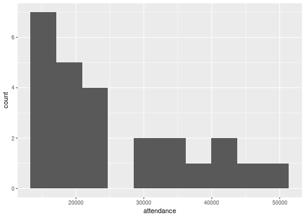


## Comments
- Attendances have substantial variability, ranging from just over
10,000 to around 50,000.
- Distribution somewhat skewed to right (but no outliers).
- These are a sample of “all possible games” (or maybe “all possible
games played in April and May”). What can we say about mean
attendance in all possible games based on this evidence?
- Think about:
  - Confidence interval
  - Hypothesis test.
  
## Getting CI for mean attendance 
- `t.test` function does CI and test. Look at CI first:


```r
t.test(jays$attendance)
```

```
## 
## 	One Sample t-test
## 
## data:  jays$attendance
## t = 11.389, df = 24, p-value = 3.661e-11
## alternative hypothesis: true mean is not equal to 0
## 95 percent confidence interval:
##  20526.82 29613.50
## sample estimates:
## mean of x 
##  25070.16
```

- From 20,500 to 29,600.

## Or, 90% CI

- by including a value for conf.level:

```r
t.test(jays$attendance, conf.level = 0.90)
```

```
## 
## 	One Sample t-test
## 
## data:  jays$attendance
## t = 11.389, df = 24, p-value = 3.661e-11
## alternative hypothesis: true mean is not equal to 0
## 90 percent confidence interval:
##  21303.93 28836.39
## sample estimates:
## mean of x 
##  25070.16
```

- From 21,300 to 28,800. (Shorter, as it should be.)


## Comments
- Need to say “column attendance within data frame jays” using $.
- 95% CI from about 20,000 to about 30,000.
- Not estimating mean attendance well at all!
- Generally want confidence interval to be shorter, which happens if:
  - SD smaller
  - sample size bigger
  - confidence level smaller
- Last one is a cheat, really, since reducing confidence level increases
chance that interval won’t contain pop. mean at all!

## Another way to access data frame columns


```r
with(jays, t.test(attendance))
```

```
## 
## 	One Sample t-test
## 
## data:  attendance
## t = 11.389, df = 24, p-value = 3.661e-11
## alternative hypothesis: true mean is not equal to 0
## 95 percent confidence interval:
##  20526.82 29613.50
## sample estimates:
## mean of x 
##  25070.16
```

## Hypothesis test
- CI answers question “what is the mean?”
- Might have a value $\mu$ in mind for the mean, and question “Is the
mean equal to $\mu$, or not?”
- For example, 2014 average attendance was 29,327.
- "Is the mean this?" answered by **hypothesis test**.
- Value being assessed goes in **null hypothesis**: here, $H_0 : \mu = 29327$.
- **Alternative hypothesis** says how null might be wrong, eg.
$H_a : \mu \ne 29327$.
- Assess evidence against null. If that evidence strong enough, *reject
null hypothesis;* if not, *fail to reject null hypothesis* (sometimes *retain null*).
- Note asymmetry between null and alternative, and utter absence of
word “accept”.

## $\alpha$ and errors
- Hypothesis test ends with decision:
  - reject null hypothesis
  - do not reject null hypothesis.
- but decision may be wrong:

\begin{center}
  
  
\begin{tabular}{|l|cc|}
\hline
  & \multicolumn{2}{c|}{Decision}\\
Truth & Do not reject & Reject null\\
\hline
Null true & Correct & Type I error\\
Null false & Type II error & Correct\\
\hline
\end{tabular}
\end{center}

- Either type of error is bad, but for now focus on controlling Type I
error: write $\alpha$ = P(type I error), and devise test so that $\alpha$ small,
typically 0.05.
- That is, **if null hypothesis true**, have only small chance to reject it
(which would be a mistake).
- Worry about type II errors later (when we consider power of test).

## Why 0.05? This man. 

\begin{columns}
  \begin{column}{0.3\textwidth}
      \includegraphics[width=\textwidth]{fisher}
  \end{column}
  \begin{column}{0.7\textwidth}
    Responsible for:
  
  \begin{itemize}
  \item analysis of variance
  \item Fisher information
  \item Linear discriminant analysis
  \item Fisher's $z$-transformation
  \item Fisher-Yates shuffle
  \item Behrens-Fisher problem
  \end{itemize}
  
   Sir Ronald A. Fisher, 1890--1962.

  \end{column}
\end{columns}


## Why 0.05? (2)
- From The Arrangement of Field Experiments (1926): 

{width=400px}

- and 

{width=400px}

## Three steps:

- from data to test statistic 
  - how far are data from null hypothesis
- from test statistic to P-value
  - how likely are you to see "data like this" **if the null hypothesis is true**
- from P-value to decision
  - reject null hypothesis if P-value small enough, fail to reject it otherwise
  
## Using `t.test`:


```r
t.test(jays$attendance, mu=29327)
```

```
## 
## 	One Sample t-test
## 
## data:  jays$attendance
## t = -1.9338, df = 24, p-value = 0.06502
## alternative hypothesis: true mean is not equal to 29327
## 95 percent confidence interval:
##  20526.82 29613.50
## sample estimates:
## mean of x 
##  25070.16
```

- See test statistic $-1.93$, P-value 0.065.
- Do not reject null at $\alpha=0.05$: no evidence that mean attendance has changed.

## Assumptions

- Theory for $t$-test: assumes normally-distributed data.
- What actually matters is sampling distribution of sample mean: if this
is approximately normal, $t$-test is OK, even if data distribution is not
normal.
- Central limit theorem: if sample size large, sampling distribution
approx. normal even if data distribution somewhat non-normal.
- So look at shape of data distribution, and make a call about whether
it is normal enough, given the sample size.

## Blue Jays attendances


```r
ggplot(jays, aes(x = attendance)) + geom_histogram(bins = 10)
```


- You might say that this is not normal enough for a sample size of $n = 25$,
in which case you don’t trust the $t$-test result.

## Another example: learning to read

- You devised new method for teaching children to read.
- Guess it will be more effective than current methods.
- To support this guess, collect data.
- Want to generalize to “all children in Canada”.
- So take random sample of all children in Canada.
- Or, argue that sample you actually have is “typical” of all children in
Canada.
- Randomization (1): whether or not a child in sample or not has
nothing to do with anything else about that child.
- Randomization (2): randomly choose whether each child gets new
reading method (t) or standard one (c).

## Reading in data 
- File at <http://www.utsc.utoronto.ca/~butler/c32/drp.txt>.
- Proper reading-in function is `read_delim` (check file to see)
- Read in thus:


```r
my_url="http://www.utsc.utoronto.ca/~butler/c32/drp.txt"
kids=read_delim(my_url," ")
```

```
## Parsed with column specification:
## cols(
##   group = col_character(),
##   score = col_double()
## )
```

## The data (some) 


```r
kids
```

```
## # A tibble: 44 x 2
##    group score
##    <chr> <dbl>
##  1 t        24
##  2 t        61
##  3 t        59
##  4 t        46
##  5 t        43
##  6 t        44
##  7 t        52
##  8 t        43
##  9 t        58
## 10 t        67
## # … with 34 more rows
```

## Boxplots


```r
ggplot(kids, aes(x = group, y = score)) + geom_boxplot()
```


## Two kinds of two-sample t-test

- Do the two groups have same spread (SD, variance)?
- If yes (shaky assumption here), can use pooled t-test.
- If not, use Welch-Satterthwaite t-test (safe).
- Pooled test derived in STAB57 (easier to derive).
- Welch-Satterthwaite is test used in STAB22 and is generally safe.
- Assess (approx) equality of spreads using boxplot.

## The (Welch-Satterthwaite) t-test
- c (control) before t (treatment) alphabetically, so proper alternative
is “less”.
- R does Welch-Satterthwaite test by default 
- new reading program really helps?
- (in a moment) how to get R to do pooled test?

## Welch-Satterthwaite 


```r
t.test(score ~ group, data = kids, alternative = "less")
```

```
## 
## 	Welch Two Sample t-test
## 
## data:  score by group
## t = -2.3109, df = 37.855, p-value = 0.01319
## alternative hypothesis: true difference in means is less than 0
## 95 percent confidence interval:
##       -Inf -2.691293
## sample estimates:
## mean in group c mean in group t 
##        41.52174        51.47619
```

## The pooled t-test 


```r
t.test(score ~ group, data = kids, 
       alternative = "less", var.equal = T)
```

```
## 
## 	Two Sample t-test
## 
## data:  score by group
## t = -2.2666, df = 42, p-value = 0.01431
## alternative hypothesis: true difference in means is less than 0
## 95 percent confidence interval:
##       -Inf -2.567497
## sample estimates:
## mean in group c mean in group t 
##        41.52174        51.47619
```

## Two-sided test; CI
- To do 2-sided test, leave out `alternative`:


```r
t.test(score ~ group, data = kids)
```

```
## 
## 	Welch Two Sample t-test
## 
## data:  score by group
## t = -2.3109, df = 37.855, p-value = 0.02638
## alternative hypothesis: true difference in means is not equal to 0
## 95 percent confidence interval:
##  -18.67588  -1.23302
## sample estimates:
## mean in group c mean in group t 
##        41.52174        51.47619
```


## Comments:

- P-values for pooled and Welch-Satterthwaite tests very similar (even though the pooled test seemed inferior): 0.013 vs.\ 0.014.
- Two-sided test also gives CI: new reading program increases average scores by
somewhere between about 1 and 19 points.
- Confidence intervals inherently two-sided, so do 2-sided test to get
them.


## Jargon for testing 

- Alternative hypothesis: what we are trying to prove (new reading program
is effective).
- Null hypothesis: “there is no difference” (new reading program no better
than current program). Must contain “equals”.
- One-sided alternative: trying to prove better (as with reading program).
- Two-sided alternative: trying to prove different.
- Test statistic: something expressing difference between data and null (eg.
difference in sample means, $t$ statistic).
- P-value: probability of observing test statistic value as extreme or
more extreme, if null is true.
- Decision: either reject null hypothesis or do not reject null
hypothesis. **Never “accept”**.

## Logic of testing 

- Work out what would happen if null hypothesis were true.
- Compare to what actually did happen.
- If these are too far apart, conclude that null hypothesis is not true
after all. (Be guided by P-value.)
- As applied to our reading programs:
  - If reading programs equally good, expect to see a difference in means
close to 0.
  - Mean reading score was 10 higher for new program.
  - Difference of 10 was unusually big (P-value small from t-test). So
conclude that new reading program is effective.
- Nothing here about what happens if null hypothesis is false. This is power
and type II error probability.

## Errors in testing

What can happen:

\begin{center}
\begin{tabular}{|l|cc|}
\hline
  & \multicolumn{2}{c|}{Decision}\\
Truth & Do not reject & Reject null\\
\hline
Null true & Correct & Type I error\\
Null false & Type II error & Correct\\
\hline
\end{tabular}  
\end{center}

Tension between truth and decision about truth (imperfect).

- Prob. of type I error denoted $\alpha$. Usually fix $\alpha$, eg. $\alpha = 0.05$.
- Prob. of type II error denoted $\beta$. Determined by the planned
experiment. Low $\beta$ good.
- Prob. of not making type II error called **power** (= $1 - \beta$). *High* power
good.

## Power

- Suppose $H_0 : \theta = 10$, $H a : \theta \ne 10$ for some parameter $\theta$.
- Suppose $H_0$ wrong. What does that say about $\theta$?
- Not much. Could have $\theta = 11$ or $\theta = 8$ or $\theta = 496$. In each case, $H_0$
wrong.
- How likely a type II error is depends on what $\theta$ is:
  - If $\theta = 496$, should be able to reject $H_0 : \theta = 10$ even for small sample,
so $\beta$ should be small (power large).
  - If $\theta = 11$, might have hard time rejecting $H_0$ even with large sample, so
$\beta$ would be larger (power smaller).
- Power depends on true parameter value, and on sample size.
- So we play “what if”: “if $\theta$ were 11 (or 8 or 496), what would power
be?”.

## Figuring out power
- Time to figure out power is before you collect any data, as part of
planning process.
- Need to have idea of what kind of departure from null hypothesis of
interest to you, eg. average improvement of 5 points on reading test
scores. (Subject-matter decision, not statistical one.)
- Then, either:
  - “I have this big a sample and this big a departure I want to detect.
What is my power for detecting it?”
  - “I want to detect this big a departure with this much power. How big a
sample size do I need?”

## How to understand/estimate power?

- Suppose we test $H_0 : \mu = 10$ against $H_a : \mu \ne 10$, where $\mu$ is
population mean.
- Suppose in actual fact, $\mu = 8$, so $H_0$ is wrong. We want to reject it.
How likely is that to happen?
- Need population SD (take $\sigma = 4$) and sample size (take $n = 15$). In
practice, get $\sigma$ from pilot/previous study, and take the $n$ we plan to
use.
- Idea: draw a random sample from the true distribution, test whether
its mean is 10 or not.
- Repeat previous step “many” times.
- “Simulation”.

## Making it go
- Random sample of 15 normal observations with mean 8 and SD 4:


```r
x = rnorm(15, 8, 4)
x
```

```
##  [1] 14.487469  5.014611  6.924277  5.201860  8.852952
##  [6] 10.835874  3.686684 11.165242  8.016188 12.383518
## [11]  1.378099  3.172503 13.074996 11.353573  5.015575
```


## ...continued 

- Test whether `x` from population with mean 10 or not (over):


```r
t.test(x, mu = 10)
```

```
## 
## 	One Sample t-test
## 
## data:  x
## t = -1.8767, df = 14, p-value = 0.08157
## alternative hypothesis: true mean is not equal to 10
## 95 percent confidence interval:
##   5.794735 10.280387
## sample estimates:
## mean of x 
##  8.037561
```


- Fail to reject the mean being 10 (a Type II error).

## or get just P-value 


```r
t.test(x, mu = 10)$p.value
```

```
## [1] 0.0815652
```


## Run this lots of times
- Two steps:
  - Generate a bunch of random samples
  - extract the P-value for the t-test from each
- without a loop!
- Use `rerun` to generate the random samples
- Use `map` to run the test on each random sample
- Use `map_dbl` to pull out the P-value for each test
- Count up how many of the P-values are 0.05 or less.

## In code


```r
rerun(1000, rnorm(15, 8, 4)) %>%
  map( ~ t.test(., mu = 10)) %>%
  map_dbl("p.value") ->
  pvals
tibble(pvals) %>% count(pvals <= 0.05)
```

```
## # A tibble: 2 x 2
##   `pvals <= 0.05`     n
##   <lgl>           <int>
## 1 FALSE             578
## 2 TRUE              422
```

We correctly rejected 422 times out of 1000, so the estimated power is
0.422.

## Calculating power

- Simulation approach very flexible: will work for any test. But answer
different each time because of randomness.
- In some cases, for example 1-sample and 2-sample t-tests, power can
be calculated.
- `power.t.test`. delta difference between null and true mean: 


```r
power.t.test(n = 15, delta = 10-8, sd = 4, type = "one.sample")
```

```
## 
##      One-sample t test power calculation 
## 
##               n = 15
##           delta = 2
##              sd = 4
##       sig.level = 0.05
##           power = 0.4378466
##     alternative = two.sided
```

## Comparison of results

  \begin{center}
  \begin{tabular}{lr}
    Method & Power\\
    \hline
    Simulation & 0.422\\
    \texttt{power.t.test} & 0.4378\\
    \hline
  \end{tabular}
    
  \end{center}

- Simulation power is similar to calculated power; to get more accurate
value, repeat more times (eg. 10,000 instead of 1,000), which takes
longer.
- CI for power based on simulation approx. $0.42 \pm 0.03$.
- With this small a sample size, the power is not great. With a bigger
sample, the sample mean should be closer to 8 most of the time, so
would reject $H_0 : \mu = 10$ more often.

## Calculating required sample size 

- Often, when planning a study, we do not have a particular sample size
in mind. Rather, we want to know how big a sample to take. This
can be done by asking how big a sample is needed to achieve a
certain power.
- The simulation approach does not work naturally with this, since you
have to supply a sample size.
- For the power-calculation method, you supply a value for the power,
but leave the sample size missing.
- Re-use the same problem: $H_0 : \mu = 10$ against 2-sided alternative,
true $\mu = 8$, $\sigma = 4$, but now aim for power 0.80.

## Using power.t.test
- No `n=`, replaced by a `power=`:


```r
power.t.test(power=0.80, delta=10-8, sd=4, type="one.sample")
```

```
## 
##      One-sample t test power calculation 
## 
##               n = 33.3672
##           delta = 2
##              sd = 4
##       sig.level = 0.05
##           power = 0.8
##     alternative = two.sided
```

- Sample size must be a whole number, so round up to 34 (to get at
least as much power as you want).

## Power curves
- Rather than calculating power for one sample size, or sample size for
one power, might want a picture of relationship between sample size
and power.
- Or, likewise, picture of relationship between difference between true
and null-hypothesis means and power.
- Called power curve.
- Build and plot it yourself.

## Building it
- If you feed power.t.test a collection (“vector”) of values, it will do
calculation for each one.
- Do power for variety of sample sizes, from 10 to 100 in steps of 10:


```r
ns=seq(10,100,10)
```

- Calculate powers:

```r
ans=power.t.test(n=ns, delta=10-8, sd=4, type="one.sample")
ans$power
```

```
##  [1] 0.2928286 0.5644829 0.7539627 0.8693979 0.9338976
##  [6] 0.9677886 0.9847848 0.9929987 0.9968496 0.9986097
```

## Building a plot
- Make a data frame out of the values to plot:

```r
d=tibble(n=ns, power=ans$power)
```

- Plot these as points joined by lines, and add horizontal line at 1
(maximum power): 

```r
g = ggplot(d, aes(x = n, y = power)) + geom_point() + 
  geom_line() + 
  geom_hline(yintercept = 1, linetype = "dashed")
```

## The power curve

```r
g
```


## Power curves for means

- Can also investigate power as it depends on what the true mean is
(the farther from null mean 10, the higher the power
will be).
- Investigate for two different sample sizes, 15 and 30.
- First make all combos of mean and sample size:


```r
means=seq(6,10,0.5)
means
```

```
## [1]  6.0  6.5  7.0  7.5  8.0  8.5  9.0  9.5 10.0
```

```r
ns=c(15,30)
ns
```

```
## [1] 15 30
```

```r
combos=crossing(mean=means, n=ns)
```

## The combos


```r
combos
```

```
## # A tibble: 18 x 2
##     mean     n
##    <dbl> <dbl>
##  1   6      15
##  2   6      30
##  3   6.5    15
##  4   6.5    30
##  5   7      15
##  6   7      30
##  7   7.5    15
##  8   7.5    30
##  9   8      15
## 10   8      30
## 11   8.5    15
## 12   8.5    30
## 13   9      15
## 14   9      30
## 15   9.5    15
## 16   9.5    30
## 17  10      15
## 18  10      30
```

## Calculate and plot

- Calculate the powers, carefully:

```r
ans=with(combos, power.t.test(n=n, delta=mean-10, sd=4, type="one.sample"))
```

- Make a data frame to plot, pulling things from the right places:

```r
d=tibble(n=factor(combos$n), mean=combos$mean, power=ans$power)
```

- then make the plot:

```r
g = ggplot(d, aes(x = mean, y = power, colour = n)) +
  geom_point() + geom_line() +
  geom_hline(yintercept = 1, linetype = "dashed")
```

## The power curves


```r
g
```


## Comments
- When `mean=10`, that is, the true mean equals the null mean, $H_0$ is
actually true, and the probability of rejecting it then is $\alpha = 0.05$.
- As the null gets more wrong (mean decreases), it becomes easier to
correctly reject it.
- The blue power curve is above the red one for any mean > 10, meaning
that no matter how wrong $H_0$ is, you always have a greater chance of
correctly rejecting it with a larger sample size.
- Previously, we had $H_0 : \mu = 10$ and a true $\mu = 8$, so a mean of 8
produces power 0.42 and 0.80 as shown on the graph.
- With $n = 34$, a true mean that is less than about 7
is almost certain to be correctly rejected. (With $n = 15$, the
difference needs to be less than 6.)

## Power by sample size for means 7 and 8
Similar procedure to before:


```r
means=c(7, 8)
ns=seq(10, 40, 5)
combos=crossing(mean=means, n=ns)
ans=with(combos, power.t.test(n=n, delta=10-mean, sd=4, type="one.sample"))
d=tibble(mean=factor(combos$mean), n=combos$n, power=ans$power)
g=ggplot(d, aes(x=n, y=power, colour=mean)) + geom_point() + geom_line() +
  geom_hline(yintercept=1,linetype="dashed")  
```

## The power curves


```r
g
```


## Two-sample power

- For kids learning to read, had sample sizes of 22 (approx) in each group
- and these group SDs:


```r
kids %>% group_by(group) %>% 
  summarize(n=n(), s=sd(score))
```

```
## # A tibble: 2 x 3
##   group     n     s
##   <chr> <int> <dbl>
## 1 c        23  17.1
## 2 t        21  11.0
```

- suppose a 5-point improvement in reading score was considered important (on this scale)
- in a 2-sample test, null (difference of) mean is zero, so `delta` is true difference in means
- what is power for these sample sizes, and what sample size would be needed to get power up to 0.80?

## calculating power for sample size 22 (per group) 


```r
power.t.test(n=22, delta=5, sd=14, type="two.sample", 
             alternative="one.sided")
```

```
## 
##      Two-sample t test power calculation 
## 
##               n = 22
##           delta = 5
##              sd = 14
##       sig.level = 0.05
##           power = 0.3158199
##     alternative = one.sided
## 
## NOTE: n is number in *each* group
```

## sample size for power 0.8 


```r
power.t.test(power=0.80, delta=5, sd=14, type="two.sample", 
             alternative="one.sided")
```

```
## 
##      Two-sample t test power calculation 
## 
##               n = 97.62598
##           delta = 5
##              sd = 14
##       sig.level = 0.05
##           power = 0.8
##     alternative = one.sided
## 
## NOTE: n is number in *each* group
```

## comments

- The power for the sample sizes we have is very small (to detect a 5-point increase).
- To get power 0.80, we need 98 kids in *each* group!

## Duality between confidence intervals and hypothesis tests 
- Tests and CIs really do the same thing, if you look at them the right
way. They are both telling you something about a parameter, and
they use same things about data.
- To illustrate, some data (two groups):

```r
my_url="http://www.utsc.utoronto.ca/~butler/c32/duality.txt"
twogroups=read_delim(my_url," ")
```

```
## Parsed with column specification:
## cols(
##   y = col_double(),
##   group = col_double()
## )
```


## The data (some) 


```r
twogroups
```

```
## # A tibble: 15 x 2
##        y group
##    <dbl> <dbl>
##  1    10     1
##  2    11     1
##  3    11     1
##  4    13     1
##  5    13     1
##  6    14     1
##  7    14     1
##  8    15     1
##  9    16     1
## 10    13     2
## 11    13     2
## 12    14     2
## 13    17     2
## 14    18     2
## 15    19     2
```

## 95% CI (default)

```r
t.test(y ~ group, data = twogroups)
```

```
## 
## 	Welch Two Sample t-test
## 
## data:  y by group
## t = -2.0937, df = 8.7104, p-value = 0.0668
## alternative hypothesis: true difference in means is not equal to 0
## 95 percent confidence interval:
##  -5.5625675  0.2292342
## sample estimates:
## mean in group 1 mean in group 2 
##        13.00000        15.66667
```

## 90% CI

```r
t.test(y ~ group, data = twogroups, conf.level = 0.90)
```

```
## 
## 	Welch Two Sample t-test
## 
## data:  y by group
## t = -2.0937, df = 8.7104, p-value = 0.0668
## alternative hypothesis: true difference in means is not equal to 0
## 90 percent confidence interval:
##  -5.010308 -0.323025
## sample estimates:
## mean in group 1 mean in group 2 
##        13.00000        15.66667
```

## Comparing results

Recall null here is $H_0 : \mu_1 - \mu_2 = 0$. P-value 0.0668. 

- 95% CI from $-5.6$ to 0.2, contains 0.
- 90% CI from $-5.0$ to $-0.3$, does not contain 0.
- At $\alpha = 0.05$, would not reject $H_0$ since P-value > 0.05.
- At $\alpha = 0.10$, would reject $H_0$ since P-value < 0.10.

Not just coincidence. Let $C = 100(1 - \alpha)$, so C% gives corresponding CI
to level-$\alpha$ test. Then following always true.
($\iff$ means ``if and only if''.)

\begin{tabular}{|rcl|}
  \hline
  Reject $H_0$ at level $\alpha$ & $\iff$ & $C\%$ CI does not contain $H_0$ value\\
  Do not reject $H_0$ at level $\alpha$ & $\iff$ & $C\%$ CI contains $H_0$ value\\
  \hline
\end{tabular}

Idea: "Plausible" parameter value inside CI, not rejected;
  "Implausible" parameter value outside CI, rejected. 
  
## The value of this
- If you have a test procedure but no corresponding CI:
- you make a CI by including all the parameter values that would not
be rejected by your test.
- Use:
  - $\alpha = 0.01$ for a 99% CI,
  - $\alpha = 0.05$ for a 95% CI,
  - $\alpha = 0.10$ for a 90% CI,
and so on.

## Testing for non-normal data
- The IRS (“Internal Revenue Service”) is the US authority that deals
with taxes (like Revenue Canada).
- One of their forms is supposed to take no more than 160 minutes to
complete. A citizen’s organization claims that it takes people longer
than that on average.
- Sample of 30 people; time to complete form recorded.
- Read in data, and do $t$-test of $H_0 : \mu = 160$ vs. $H_a : \mu > 160$.
- For reading in, there is only one column, so can pretend it is delimited
by anything.
  
## Read in data 

```r
my_url="http://www.utsc.utoronto.ca/~butler/c32/irs.txt"
irs = read_csv(my_url)
```

```
## Parsed with column specification:
## cols(
##   Time = col_double()
## )
```

```r
irs %>% glimpse()
```

```
## Observations: 30
## Variables: 1
## $ Time <dbl> 91, 64, 243, 167, 123, 65, 71, 204, 110…
```

## Test whether mean is 160 or greater

```r
t.test(irs$Time, mu = 160, alternative = "greater")
```

```
## 
## 	One Sample t-test
## 
## data:  irs$Time
## t = 1.8244, df = 29, p-value = 0.03921
## alternative hypothesis: true mean is greater than 160
## 95 percent confidence interval:
##  162.8305      Inf
## sample estimates:
## mean of x 
##  201.2333
```

Reject null; mean greater than 160.

## But, look at a graph

```r
ggplot(irs, aes(x = Time)) + geom_histogram(bins = 10)
```

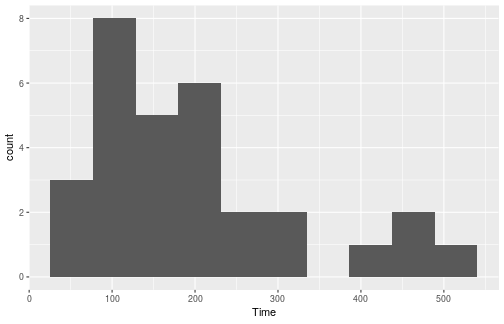

Skewed to right. Should look at median.

## The sign test
- But how to test whether the median is greater than 160?
- Idea: if the median really is 160 ($H_0$ true), the sampled values from
the population are equally likely to be above or below 160.
- If the population median is greater than 160, there will be a lot of
sample values greater than 160, not so many less. Idea: test statistic
is number of sample values greater than hypothesized median.
- How to decide whether “unusually many” sample values are greater
than 160? Need a sampling distribution.
- If $H_0$ true, pop. median is 160, then each sample value independently
equally likely to be above or below 160.
- So number of observed values above 160 has binomial distribution
with $n = 30$ (number of data values) and $p = 0.5$ (160 is
hypothesized to be *median*).

## Obtaining P-value for sign test 1/2

- Count values above/below 160:

```r
irs %>% count(Time > 160)
```

```
## # A tibble: 2 x 2
##   `Time > 160`     n
##   <lgl>        <int>
## 1 FALSE           13
## 2 TRUE            17
```

- 17 above, 13 below. How unusual is that? Need a *binomial table*.

## Obtaining P-value for sign test 2/2
- R function `dbinom` gives the probability of eg. exactly 17 successes in
a binomial with $n = 30$ and $p = 0.5$:

```r
dbinom(17, 30, 0.5)
```

```
## [1] 0.1115351
```

- but we want probability of 17 *or more*, so get all of those, find probability of each,  and add them up: 

```r
tibble(x=17:30) %>% 
  mutate(prob=dbinom(x, 30, 0.5)) %>% 
  summarize(total=sum(prob))
```

```
## # A tibble: 1 x 1
##   total
##   <dbl>
## 1 0.292
```


## Using my package `smmr`
- I wrote a package `smmr` to do the sign test (and some other things).
Installation is a bit fiddly:
  - Install devtools with `install.packages("devtools")`
  - then install smmr: 

```r
library(devtools)
install_github("nxskok/smmr")
```
- Then load it:

```r
library(smmr)
```

## `smmr` for sign test
- `smmr`’s function `sign_test` needs three inputs: a data frame, a
column and a null median:

```r
sign_test(irs, Time, 160)
```

```
## $above_below
## below above 
##    13    17 
## 
## $p_values
##   alternative   p_value
## 1       lower 0.8192027
## 2       upper 0.2923324
## 3   two-sided 0.5846647
```

## Comments (1/3)

- Testing whether population median *greater than* 160, so want
*upper-tail* P-value 0.2923. Same as before.
- Also get table of values above and below; this too as we got.

## Comments (2/3)
- P-values are:
    \begin{center}
    \begin{tabular}{lr}
      Test & P-value\\
      \hline
      $t$ & 0.0392\\
      Sign & 0.2923\\
      \hline
    \end{tabular}
      
    \end{center}
- These are very different: we reject a mean of 160 (in favour of the
mean being bigger), but clearly *fail* to reject a median of 160 in
favour of a bigger one.
- Why is that? Obtain mean and median: 

```r
irs %>% summarize(mean = mean(Time), median = median(Time))
```

```
## # A tibble: 1 x 2
##    mean median
##   <dbl>  <dbl>
## 1  201.   172.
```

## Comments (3/3)
- The mean is pulled a long way up by the right skew, and is a fair bit
bigger than 160.
- The median is quite close to 160.
- We ought to be trusting the sign test and not the t-test here (median
and not mean), and therefore there is no evidence that the “typical”
time to complete the form is longer than 160 minutes.
- Having said that, there are clearly some people who take a lot longer
than 160 minutes to complete the form, and the IRS could focus on
simplifying its form for these people.
- In this example, looking at any kind of average is not really helpful; a
better question might be “do an unacceptably large fraction of people
take longer than (say) 300 minutes to complete the form?”: that is,
thinking about worst-case rather than average-case.

## Confidence interval for the median
- The sign test does not naturally come with a confidence interval for
the median.
- So we use the “duality” between test and confidence interval to say:
the (95%) confidence interval for the median contains exactly those
values of the null median that would not be rejected by the two-sided
sign test (at $\alpha = 0.05$).

## For our data
- The procedure is to try some values for the null median and see which
ones are inside and which outside our CI.
- smmr has pval_sign that gets just the 2-sided P-value:

```r
pval_sign(160, irs, Time)
```

```
## [1] 0.5846647
```

- Try a couple of null medians:

```r
pval_sign(200, irs, Time)
```

```
## [1] 0.3615946
```

```r
pval_sign(300, irs, Time)
```

```
## [1] 0.001430906
```

- So 200 inside the 95% CI and 300 outside.

## Doing a whole bunch
- Choose our null medians first:

```r
(d=tibble(null_median=seq(100,300,20)))
```

```
## # A tibble: 11 x 1
##    null_median
##          <dbl>
##  1         100
##  2         120
##  3         140
##  4         160
##  5         180
##  6         200
##  7         220
##  8         240
##  9         260
## 10         280
## 11         300
```

## ... and then

“for
each null median, run the function `pval_sign` for that null median
and get the P-value”: 


```r
d %>% mutate(p_value = map_dbl(null_median, 
                               ~ pval_sign(., irs, Time)))
```

```
## # A tibble: 11 x 2
##    null_median  p_value
##          <dbl>    <dbl>
##  1         100 0.000325
##  2         120 0.0987  
##  3         140 0.200   
##  4         160 0.585   
##  5         180 0.856   
##  6         200 0.362   
##  7         220 0.0428  
##  8         240 0.0161  
##  9         260 0.00522 
## 10         280 0.00143 
## 11         300 0.00143
```

## Make it easier for ourselves 


```r
d %>% 
  mutate(p_value = map_dbl(null_median, 
                           ~ pval_sign(., irs, Time))) %>%
  mutate(in_out = ifelse(p_value > 0.05, "inside", "outside"))
```

```
## # A tibble: 11 x 3
##    null_median  p_value in_out 
##          <dbl>    <dbl> <chr>  
##  1         100 0.000325 outside
##  2         120 0.0987   inside 
##  3         140 0.200    inside 
##  4         160 0.585    inside 
##  5         180 0.856    inside 
##  6         200 0.362    inside 
##  7         220 0.0428   outside
##  8         240 0.0161   outside
##  9         260 0.00522  outside
## 10         280 0.00143  outside
## 11         300 0.00143  outside
```


## confidence interval for median?

- 95% CI to this accuracy from 120 to 200.
- Can get it more accurately by looking more closely in intervals from
100 to 120, and from 200 to 220.

## A more efficient way: bisection
- Know that top end of CI between 200 and 220:

```r
lo=200 
hi=220
```

- Try the value halfway between: is it inside or outside?

```r
(try = (lo + hi) / 2)
```

```
## [1] 210
```

```r
pval_sign(try,irs,Time)
```

```
## [1] 0.09873715
```

- Inside, so upper end is between 210 and 220. Repeat (over):

## ... bisection continued 


```r
lo = try
(try = (lo + hi) / 2)
```

```
## [1] 215
```

```r
pval_sign(try, irs, Time)
```

```
## [1] 0.06142835
```

- 215 is inside too, so upper end between 215 and 220. 
- Continue until have as accurate a result as you want.

## Bisection automatically

- A loop, but not a `for` since we don’t know how many times we’re
going around. Keep going while a condition is true:

```r
lo = 200
hi = 220
while (hi - lo > 1) {
  try = (hi + lo) / 2
  ptry = pval_sign(try, irs, Time)
  print(c(try, ptry))
  if (ptry <= 0.05)
    hi = try
  else
    lo = try
}
```

## The output from this loop


```
## [1] 210.00000000   0.09873715
## [1] 215.00000000   0.06142835
## [1] 217.50000000   0.04277395
## [1] 216.25000000   0.04277395
## [1] 215.62500000   0.04277395
```

- 215 inside, 215.625 outside. Upper end of interval to this accuracy is 215.

## Using smmr
- `smmr` has function `ci_median` that does this (by default 95% CI):

```r
ci_median(irs,Time)
```

```
## [1] 119.0065 214.9955
```

- Uses a more accurate bisection than we did.
- Or get, say, 90% CI for median:

```r
ci_median(irs,Time,conf.level=0.90)
```

```
## [1] 123.0031 208.9960
```

- 90% CI is shorter, as it should be.

## Matched pairs

Some data: 

\centering{
  \includegraphics[height=0.7\textheight]{Screenshot_2019-04-26_13-41-29}
}


## Matched pairs data
- Data are comparison of 2 drugs for effectiveness at reducing pain.
- 12 subjects (cases) were arthritis sufferers
- Response is #hours of pain relief from each drug.
- In reading example, each child tried only one reading method.
- But here, each subject tried out both drugs, giving us two
measurements.
- Possible because, if you wait long enough, one drug has no influence
over effect of other.
- Advantage: focused comparison of drugs. Compare one drug with
another on same person, removes a lot of variability due to differences between people. 
- Matched pairs, requires different analysis. 
- Design: randomly choose 6 of 12 subjects to get drug A first, other 6
get drug B first.

## Paired t test: reading the data
Values aligned in columns:  


```r
my_url="http://www.utsc.utoronto.ca/~butler/c32/analgesic.txt"
pain=read_table(my_url)
```

```
## Parsed with column specification:
## cols(
##   subject = col_double(),
##   druga = col_double(),
##   drugb = col_double()
## )
```

## The data


```r
pain
```

```
## # A tibble: 12 x 3
##    subject druga drugb
##      <dbl> <dbl> <dbl>
##  1       1   2     3.5
##  2       2   3.6   5.7
##  3       3   2.6   2.9
##  4       4   2.6   2.4
##  5       5   7.3   9.9
##  6       6   3.4   3.3
##  7       7  14.9  16.7
##  8       8   6.6   6  
##  9       9   2.3   3.8
## 10      10   2     4  
## 11      11   6.8   9.1
## 12      12   8.5  20.9
```

## Paired *t*-test 


```r
with(pain, t.test(druga, drugb, paired = T))
```

```
## 
## 	Paired t-test
## 
## data:  druga and drugb
## t = -2.1677, df = 11, p-value = 0.05299
## alternative hypothesis: true difference in means is not equal to 0
## 95 percent confidence interval:
##  -4.29941513  0.03274847
## sample estimates:
## mean of the differences 
##               -2.133333
```

P-value is 0.053. Likewise, you can calculate the differences yourself and
do a 1-sample t-test on them, over:

## t-testing the differences
- First calculate a column of differences (in data frame):

```r
(pain %>% mutate(diff=druga-drugb) -> pain)
```

```
## # A tibble: 12 x 4
##    subject druga drugb    diff
##      <dbl> <dbl> <dbl>   <dbl>
##  1       1   2     3.5  -1.5  
##  2       2   3.6   5.7  -2.1  
##  3       3   2.6   2.9  -0.300
##  4       4   2.6   2.4   0.2  
##  5       5   7.3   9.9  -2.6  
##  6       6   3.4   3.3   0.1  
##  7       7  14.9  16.7  -1.80 
##  8       8   6.6   6     0.600
##  9       9   2.3   3.8  -1.5  
## 10      10   2     4    -2    
## 11      11   6.8   9.1  -2.3  
## 12      12   8.5  20.9 -12.4
```

## t-test on the differences
- then throw them into t.test, testing that the mean is zero, with
same result as before:

```r
with(pain,t.test(diff,mu=0))
```

```
## 
## 	One Sample t-test
## 
## data:  diff
## t = -2.1677, df = 11, p-value = 0.05299
## alternative hypothesis: true mean is not equal to 0
## 95 percent confidence interval:
##  -4.29941513  0.03274847
## sample estimates:
## mean of x 
## -2.133333
```

## Assessing normality 
- 1-sample and 2-sample t-tests assume (each) group normally
distributed.
- Matched pairs analyses assume (theoretically) that differences
normally distributed.
- Though we know that t-tests generally behave well even without
normality.
- How to assess normality? A normal quantile plot.
  - Idea: scatter of points should follow the straight line, without curving.
  - Outliers show up at bottom left or top right of plot as points off the
line.

## The normal quantile plot

- of differences from matched pairs data


```r
ggplot(pain,aes(sample=diff))+stat_qq()+stat_qq_line()
```


- Points should follow the straight line. Bottom left one way off, so
normality questionable here: outlier.

## More normal quantile plots
- How straight does a normal quantile plot have to be?
- There is randomness in real data, so even a normal quantile plot from
normal data won’t look perfectly straight.
- With a small sample, can look not very straight even from normal
data.
- Looking for systematic departure from a straight line; random wiggles
ought not to concern us.
- Look at some examples where we know the answer, so that we can
see what to expect.

## Normal data, large sample check randomness from here


```r
d=tibble(x=rnorm(200))
ggplot(d,aes(x=x))+geom_histogram(bins=10)
```


As normal as you could wish for.

## The normal quantile plot


```r
ggplot(d,aes(sample=x))+stat_qq()+stat_qq_line()
```


## Normal data, small sample 


```r
d=tibble(x=rnorm(20))
ggplot(d,aes(x=x))+geom_histogram(bins=10)
```

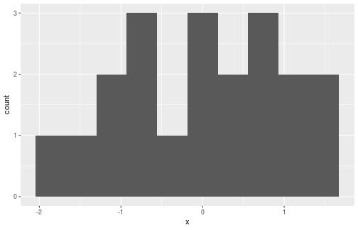

- Not so convincingly normal, but not obviously skewed.

## The normal quantile plot


```r
ggplot(d,aes(sample=x))+stat_qq()+stat_qq_line()
```


Good, apart from the highest and lowest points being slightly off. I’d call
this good.

## Chi-squared data, *df* = 10


```r
d=tibble(x=rchisq(100,10))
ggplot(d,aes(x=x))+geom_histogram(bins=10)
```


Somewhat skewed to right.

## The normal quantile plot


```r
ggplot(d,aes(sample=x))+stat_qq()+stat_qq_line()
```


Somewhat opening-up curve.

## Chi-squared data, df = 3 


```r
d=tibble(x=rchisq(100,3))
ggplot(d,aes(x=x))+geom_histogram(bins=10)
```

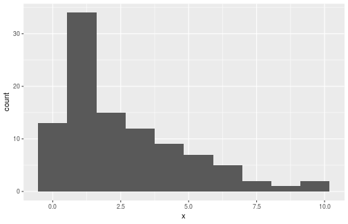


Definitely skewed to right.

## The normal quantile plot


```r
ggplot(d,aes(sample=x))+stat_qq()+stat_qq_line()
```


Clear upward-opening curve.

## t-distributed data, df = 3 

```r
d=tibble(x=rt(300,3))
ggplot(d,aes(x=x))+geom_histogram(bins=10)
```

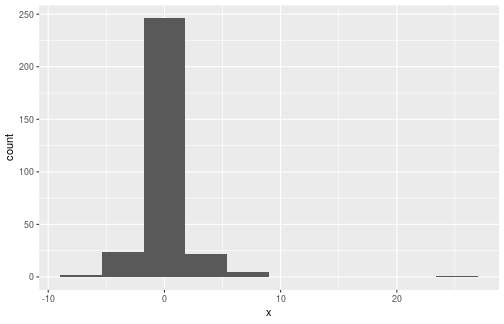


Long tails (or a very sharp peak).

## The normal quantile plot


```r
ggplot(d,aes(sample=x))+stat_qq()+stat_qq_line()
```


Low values too low and high values too high for normal.

## Our pain-relief data 


```r
ggplot(pain,aes(sample=diff))+stat_qq()+stat_qq_line()
```

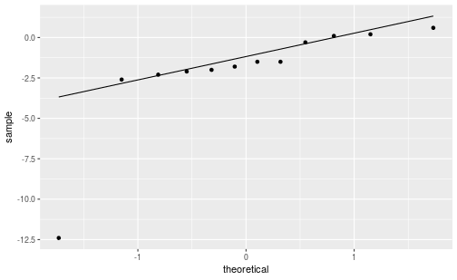


- Definitely not normal. What to do?
- Sign test on differences, null median 0.

## Sign test
- Most easily: calculate differences in data frame, then use `smmr`.
- Null median difference is 0:


```r
pain %>% mutate(mydiff=druga-drugb) %>%
sign_test(mydiff,0)
```

```
## $above_below
## below above 
##     9     3 
## 
## $p_values
##   alternative    p_value
## 1       lower 0.07299805
## 2       upper 0.98071289
## 3   two-sided 0.14599609
```


## Comments 

- P-value 0.1460. No evidence that the drugs are different.
- Since we are working in a pipeline, input data frame to `sign_test` is
“whatever came out of previous step”.


## (Some of) the kids’ reading data, again


```r
kids %>% sample_n(12)
```

```
## # A tibble: 12 x 2
##    group score
##    <chr> <dbl>
##  1 c        33
##  2 t        61
##  3 t        43
##  4 t        58
##  5 t        57
##  6 t        53
##  7 c        10
##  8 c        60
##  9 c        54
## 10 c        37
## 11 t        52
## 12 t        49
```

## Where we are at 

- 21 kids in “treatment”, new reading method; 23 in “control”,
standard reading method.

- Assessing assumptions:
  - We did two-sample t-test (Satterthwaite-Welch) before.
  - Assumes approx. normal data within each group.
  - Does not assume equal spread.
  - (Pooled t-test *does* assume equal spread).
  - Assess each group separately. 

## Boxplots for reading data


```r
ggplot(kids,aes(x=group,y=score))+geom_boxplot()
```


## Facetted normal quantile plots
Done this way:


```r
ggplot(kids,aes(sample=score))+stat_qq()+stat_qq_line()+
facet_wrap(~group)
```


## Comments
- These plots show no problems with normality. Both groups are more
or less symmetric/normal and there are no outliers.
- Equal spreads questionable, but we don’t need that.
- Assess equal spreads by looking at *slopes* of normal quantile plots.
- We ought be happy with the (Welch) two-sample t-test (over)


## Welch two-sample test


```r
t.test(score~group,data=kids,alternative="less")
```

```
## 
## 	Welch Two Sample t-test
## 
## data:  score by group
## t = -2.3109, df = 37.855, p-value = 0.01319
## alternative hypothesis: true difference in means is less than 0
## 95 percent confidence interval:
##       -Inf -2.691293
## sample estimates:
## mean in group c mean in group t 
##        41.52174        51.47619
```

from which we concluded that the new reading method really does
help.

## What to do if normality fails
- (On the previous page, the only indication of non-normality is the
highest score in the control group, which is a little too high for
normality.)
- If normality fails (for one or both of the groups), what do we do then?
- Again, can compare medians: use the thought process of the sign test,
which does not depend on normality and is not damaged by outliers.
- A suitable test called Mood’s median test.
- Before we get to that, a diversion.

## The chi-squared test for independence

Suppose we want to know whether people are in favour of having
daylight savings time all year round. We ask 20 males and 20 females
whether they each agree with having DST all year round (“yes”) or
not (“no”). Some of the data: 


```r
my_url="http://www.utsc.utoronto.ca/~butler/c32/dst.txt"
dst=read_delim(my_url," ")
dst %>% sample_n(5) # randomly sample 5 rows
```

```
## # A tibble: 5 x 2
##   gender agree
##   <chr>  <chr>
## 1 male   yes  
## 2 male   yes  
## 3 male   no   
## 4 male   no   
## 5 female no
```

## ... continued

Count up individuals in each category combination, and arrange in
contingency table:

```r
tab=with(dst,table(gender,agree))
tab
```

```
##         agree
## gender   no yes
##   female 11   9
##   male    3  17
```

- Most of the males say “yes”, but the females are about evenly split.
- Looks like males more likely to say “yes”, ie. an association between
gender and agreement.
- Test an $H_0$ of “no association” (“independence”) vs. alternative that
there is really some association. 
- Done with `chisq.test`.

## ...And finally


```r
chisq.test(tab,correct=F)
```

```
## 
## 	Pearson's Chi-squared test
## 
## data:  tab
## X-squared = 7.033, df = 1, p-value = 0.008002
```

- Reject null hypothesis of no association
- therefore there is a difference in rates of agreement between (all)
males and females (or that gender and agreement are associated).
- Without `correct=F` uses “Yates correction”; this way, should give
same answers as calculated by hand (if you know how).

## Mood’s median test
- Before our diversion, we wanted to compare medians of two groups.
- Recall sign test: count number of values above and below something
(there, hypothesized median).
- Idea of Mood’s median test:
  - Work out the median of all the data, regardless of group (“grand
median”).
  - Count how many data values in each group are above/below this grand
median.
  - Make contingency table of group vs. above/below.
  - Test for association.
- If group medians equal, each group should have about half its
observations above/below grand median. If not, one group will be
mostly above grand median and other below.

## Mood’s median test for reading data
- Find overall median score: 

```r
(kids %>% summarize(med=median(score)) %>% pull(med) -> m)
```

```
## [1] 47
```

- Make table of above/below vs. group:

```r
tab=with(kids,table(group,score>m))
tab
```

```
##      
## group FALSE TRUE
##     c    15    8
##     t     7   14
```


- Treatment group scores mostly above median, control group scores
mostly below, as expected.

## The test
- Do chi-squared test:

```r
chisq.test(tab,correct=F)
```

```
## 
## 	Pearson's Chi-squared test
## 
## data:  tab
## X-squared = 4.4638, df = 1, p-value = 0.03462
```


- This test actually two-sided (tests for any association). 
- Here want to test that new reading method *better* (one-sided).
- Most of treatment children above overall median, so
do 1-sided test by halving P-value to get 0.017. 
- This way too, children do better at learning to read using the new
method.

## Or by smmr
- `median_test` does the whole thing:


```r
median_test(kids,score,group)
```

```
## $table
##      above
## group above below
##     c     8    15
##     t    14     7
## 
## $test
##        what      value
## 1 statistic 4.46376812
## 2        df 1.00000000
## 3   P-value 0.03462105
```

- P-value again two-sided.

## Comments
- P-value 0.013 for (1-sided) t-test, 0.017 for (1-sided) Mood median
test.
- Like the sign test, Mood’s median test doesn’t use the data very
efficiently (only, is each value above or below grand median).
- Thus, if we can justify doing *t*-test, we should do it. This is the case
here.
- The *t*-test will usually give smaller P-value because it uses the data
more efficiently.
- The time to use Mood’s median test is if we are definitely unhappy
with the normality assumption (and thus the t-test P-value is not to
be trusted).

## Jumping rats
- Link between exercise and healthy bones (many studies).
- Exercise stresses bones and causes them to get stronger.
- Study (Purdue): effect of jumping on bone density of growing rats.
- 30 rats, randomly assigned to 1 of 3 treatments:
  - No jumping (control)
  - Low-jump treatment (30 cm)
  - High-jump treatment (60 cm)
- 8 weeks, 10 jumps/day, 5 days/week.
- Bone density of rats (mg/cm 3 ) measured at end.
- See whether larger amount of exercise (jumping) went with higher
bone density.
- Random assignment: rats in each group similar in all important ways.
- So entitled to draw conclusions about cause and effect.

## Reading the data
Values separated by spaces:

```r
my_url="http://www.utsc.utoronto.ca/~butler/c32/jumping.txt"
rats=read_delim(my_url," ")
```

```
## Parsed with column specification:
## cols(
##   group = col_character(),
##   density = col_double()
## )
```

## The data (some random rows) 


```r
rats %>% sample_n(12)
```

```
## # A tibble: 12 x 2
##    group    density
##    <chr>      <dbl>
##  1 Highjump     650
##  2 Control      554
##  3 Control      614
##  4 Control      621
##  5 Highjump     643
##  6 Lowjump      594
##  7 Control      600
##  8 Lowjump      596
##  9 Control      593
## 10 Lowjump      638
## 11 Lowjump      588
## 12 Highjump     626
```

## Boxplots


```r
ggplot(rats,aes(y=density,x=group))+geom_boxplot()
```


## Or, arranging groups in data (logical) order

```r
ggplot(rats,aes(y=density,x=fct_inorder(group)))+
geom_boxplot()
```


## Analysis of Variance
- Comparing > 2 groups of independent observations (each rat only
does one amount of jumping).
- Standard procedure: analysis of variance (ANOVA).
- Null hypothesis: all groups have same mean.
- Alternative: “not all means the same”, at least one is different from
others.

## Testing: ANOVA in R


```r
rats.aov=aov(density~group,data=rats)
summary(rats.aov)
```

```
##             Df Sum Sq Mean Sq F value Pr(>F)   
## group        2   7434    3717   7.978 0.0019 **
## Residuals   27  12579     466                  
## ---
## Signif. codes:  
## 0 '***' 0.001 '**' 0.01 '*' 0.05 '.' 0.1 ' ' 1
```

- Usual ANOVA table, small P-value: significant result.
- Conclude that the mean bone densities are not all equal.
- Reject null, but not very useful finding.

## Which groups are different from which?
- ANOVA really only answers half our questions: it says “there are
differences”, but doesn’t tell us which groups different.
- One possibility (not the best): compare all possible pairs of groups,
via two-sample t.
- First pick out each group:


```r
rats %>% filter(group=="Control") -> controls
rats %>% filter(group=="Lowjump") -> lows
rats %>% filter(group=="Highjump") -> highs
```

## Control vs. low


```r
t.test(controls$density,lows$density)
```

```
## 
## 	Welch Two Sample t-test
## 
## data:  controls$density and lows$density
## t = -1.0761, df = 16.191, p-value = 0.2977
## alternative hypothesis: true difference in means is not equal to 0
## 95 percent confidence interval:
##  -33.83725  11.03725
## sample estimates:
## mean of x mean of y 
##     601.1     612.5
```

No sig. difference here.

## Control vs. high


```r
t.test(controls$density,highs$density)
```

```
## 
## 	Welch Two Sample t-test
## 
## data:  controls$density and highs$density
## t = -3.7155, df = 14.831, p-value = 0.002109
## alternative hypothesis: true difference in means is not equal to 0
## 95 percent confidence interval:
##  -59.19139 -16.00861
## sample estimates:
## mean of x mean of y 
##     601.1     638.7
```

These are different.

## Low vs. high


```r
t.test(lows$density,highs$density)
```

```
## 
## 	Welch Two Sample t-test
## 
## data:  lows$density and highs$density
## t = -3.2523, df = 17.597, p-value = 0.004525
## alternative hypothesis: true difference in means is not equal to 0
## 95 percent confidence interval:
##  -43.15242  -9.24758
## sample estimates:
## mean of x mean of y 
##     612.5     638.7
```

These are different too.

## But...
- We just did 3 tests instead of 1.
- So we have given ourselves 3 chances to reject $H_0:$ all means equal,
instead of 1.
- Thus $\alpha$ for this combined test is not 0.05.

## John W. Tukey 

  \begin{columns}
    \begin{column}{0.4\textwidth}
      \includegraphics[width=\textwidth]{John_Tukey}
    \end{column}
    \begin{column}{0.6\textwidth}
      \begin{itemize}
      \item American statistician, 1915--2000
      \item Big fan of exploratory data analysis
      \item Invented boxplot
      \item Invented "honestly significant differences"
      \item Invented jackknife estimation
      \item Coined computing term "bit"
      \item Co-inventor of Fast Fourier Transform
      \end{itemize}
    \end{column}
  \end{columns}
  

## Honestly Significant Differences
- Compare several groups with one test, telling you which groups differ
from which.
- Idea: if all population means equal, find distribution of highest sample
mean minus lowest sample mean.
- Any means unusually different compared to that declared significantly
different.

## Tukey on rat data


```r
rats.aov=aov(density~group,data=rats)
TukeyHSD(rats.aov)
```

```
##   Tukey multiple comparisons of means
##     95% family-wise confidence level
## 
## Fit: aov(formula = density ~ group, data = rats)
## 
## $group
##                   diff       lwr       upr     p adj
## Highjump-Control  37.6  13.66604 61.533957 0.0016388
## Lowjump-Control   11.4 -12.53396 35.333957 0.4744032
## Lowjump-Highjump -26.2 -50.13396 -2.266043 0.0297843
```


Again conclude that bone density for highjump group significantly higher
than for other two groups.

## Why Tukey’s procedure better than all t-tests 
Look at P-values for the two tests:

```
Comparison        Tukey    t-tests
----------------------------------
Highjump-Control 0.0016     0.0021
Lowjump-Control  0.4744     0.2977
Lowjump-Highjump 0.0298     0.0045
```

  
- Tukey P-values (mostly) higher.
- Proper adjustment for doing three t-tests at once, not just one in
isolation.
- `lowjump-highjump` comparison would no longer be significant at
$\alpha = 0.01$.

## Checking assumptions


```r
ggplot(rats,aes(y=density,x=fct_inorder(group)))+
geom_boxplot()
```


Assumptions:
- Normally distributed data within each group
- with equal group SDs.

## Normal quantile plots by group


```r
ggplot(rats, aes(sample = density)) + stat_qq() + stat_qq_line() +
  facet_wrap( ~ group)
```

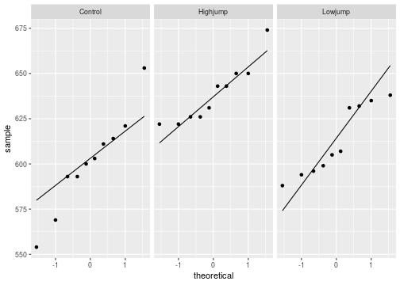

## The assumptions
- Normally-distributed data within each group
- Equal group SDs.
These are shaky here because:
- control group has outliers
- highjump group appears to have less spread than others.
Possible remedies (in general):
- Transformation of response (usually works best when SD increases
with mean)
- If normality OK but equal spreads not, can use Welch ANOVA.
(Regular ANOVA like pooled t-test; Welch ANOVA like
Welch-Satterthwaite t-test.)
- Can also use Mood’s Median Test (see over). This works for any
number of groups.

## Mood’s median test 1/3
- Find median of all bone densities, regardless of group:


```r
(rats %>% summarize(med = median(density)) %>% pull(med) -> m)
```

```
## [1] 621.5
```

- Count up how many observations in each group above or below
overall median:


```r
tab = with(rats, table(group, density > m))
tab
```

```
##           
## group      FALSE TRUE
##   Control      9    1
##   Highjump     0   10
##   Lowjump      6    4
```


## Mood’s median test 2/4 


```r
tab
```

```
##           
## group      FALSE TRUE
##   Control      9    1
##   Highjump     0   10
##   Lowjump      6    4
```


- All Highjump obs above overall median.
- Most Control obs below overall
median.
- Suggests medians differ by group.

## Mood’s median test 3/4 
- Test whether association between group and being above/below
overall median significant using chi-squared test for association:


```r
chisq.test(tab,correct=F)
```

```
## 
## 	Pearson's Chi-squared test
## 
## data:  tab
## X-squared = 16.8, df = 2, p-value = 0.0002249
```

- Very small P-value says that being above/below overall median
depends on group.
- That is, groups do not all have same median.

## Mood’s median test 4/4 
Or with `median_test` from `smmr`, same as before. 


```r
median_test(rats,density,group)
```

```
## $table
##           above
## group      above below
##   Control      1     9
##   Highjump    10     0
##   Lowjump      4     6
## 
## $test
##        what        value
## 1 statistic 1.680000e+01
## 2        df 2.000000e+00
## 3   P-value 2.248673e-04
```


## Comments
- No doubt that medians differ between groups (not all same). 
- This test is equivalent of $F$-test, not of Tukey. 
- To determine which groups differ from which, can compare all possible
pairs of groups via (2-sample) Mood’s median tests, then adjust
P-values by multiplying by number of 2-sample Mood tests done (Bonferroni):


```r
pairwise_median_test(rats,density,group)
```

```
## # A tibble: 3 x 4
##   g1       g2        p_value adj_p_value
##   <chr>    <chr>       <dbl>       <dbl>
## 1 Control  Highjump 0.000148    0.000443
## 2 Control  Lowjump  0.371       1       
## 3 Highjump Lowjump  0.371       1
```

- Now, lowjump-highjump difference no longer significant. 

## Welch ANOVA
- For these data, Mood’s median test probably best because we doubt
both normality and equal spreads.
- When normality OK but spreads differ, Welch ANOVA way to go.
- Welch ANOVA done by `oneway.test` as shown (for illustration):


```r
oneway.test(density~group,data=rats)
```

```
## 
## 	One-way analysis of means (not assuming equal
## 	variances)
## 
## data:  density and group
## F = 8.8164, num df = 2.000, denom df = 17.405,
## p-value = 0.002268
```

- P-value very similar, as expected.
- Appropriate Tukey-equivalent here called Games-Howell.

## Games-Howell

- Lives in package `PMCMRplus` (also `userfriendlyscience`). Install
first.


```r
library(PMCMRplus)
gamesHowellTest(density~factor(group),data=rats)
```

```
## 
## 	Pairwise comparisons using Games-Howell test
```

```
## data: density by factor(group)
```

```
##          Control Highjump
## Highjump 0.0056  -       
## Lowjump  0.5417  0.0120
```

```
## 
## P value adjustment method: none
```

```
## alternative hypothesis: two.sided
```


# Writing reports


## Communicating your results

Being a statistician means being able to do several things:

1. Obtain and process the data for analysis
2. Do a suitable analysis
3. Check that the analysis was reasonable
4. Communicate your findings to the world

The last part is perhaps the most important, because analyses do not exist
in isolation; you do an analysis to answer a question, and the answer to
the question is the most important thing.

This is true whether you are in the corporate world, answering to a boss,
or in graduate school, where you will eventually have to convince your
thesis committee (and, by extension, the academic world) that what you
have done is interesting, statistically sound and important.

## Reports
- Final step of your process is to write a report. This is a sales job,
because you have to convince your readers that what you have done
is worth their time reading.
- Writing a report requires good language skills. You cannot become a
good statistician without that.
- This is why so many of my questions end “explain briefly”. You need
to learn to provide a complete and concise explanation of what your
results tell you and why.
- Reports are usually structured in a similar way, as shown on next page.

## Report structure
*Introduction*: tell your readers about your problem and what you hope to
find out. You need to provide enough explanation for the
reader to know what you’re trying to achieve. You might
also want to refer to what other people have done.

*Methods*: Where the data came from, and how it was collected
(describing the technology that was used, if any). Scientific
people call this section “Methods”. If you needed to do any
work to get the data into the right form, this is also the
place to describe that.

*Analysis and results*: It is not enough to give the analysis; you have to
explain what you are doing and what made you do it. The
results should be described in a matter-of-fact way (the
opinions come in the next section).

*Conclusions*: What does the analysis tell you about your problem? Place
the results in context. Offer (supported) opinions about
what the results mean, to you and the world.

## A typical journal article

http://jap.physiology.org/content/100/3/839

\includegraphics[width=\textwidth]{titlebar}  

Title and authors, with journal and page numbers, so that you have
everything you need to refer to it.

## Abstract
Journal articles typically begin with Abstract that summarizes question
and gives highlights of results and conclusion, and tells you whether paper is worth your while to read. 

\includegraphics[width=0.7\textwidth]{abstract}  


## Introduction

\includegraphics[width=\textwidth]{intro}

Introduction begins with plain-English first sentence. The numbers in
brackets are references to what other people have said.

## Materials and methods

\includegraphics[width=0.75\textwidth]{matmeth} 

The subjects. Experiments on humans require “ethical approval”. 

## Taking measurements

\includegraphics[width=0.9\textwidth]{measurements}

...

\includegraphics[width=0.9\textwidth]{measurementb}  

## Results (a)

  \includegraphics[width=\textwidth]{resultsa}  

...noting that the two groups were not significantly different before the
study, but changed in important respects over time.
Results also shown in table.

## Results (b)

 \includegraphics[width=0.7\textwidth]{resultsb}  

Graph showing that bone mass density has changed greatly as a result of
the jumping. (Graphs are always good.)

## Conclusions (selected) 1/2 

 \includegraphics[width=0.9\textwidth]{conc1}  
 
...

\includegraphics[width=0.9\textwidth]{conc2} 

## Conclusions 2/2

 \includegraphics[width=0.9\textwidth]{conc3}  
 
Note use of (relatively) plain English, description of most important
findings, comparisons to other work, and admission of limitations.

## References to other work (some)

 \includegraphics[width=0.9\textwidth]{refs}  
 
## Reproducibility
- The paper we just looked at contained a lot of information.
- Partly, this was to show that the researchers followed proper
procedure (important with human subjects).
- Also allows anyone to do analysis on same data and get same results
(reproducible).
- Allows anyone to follow same procedure on own data and see if
results same (replication).
- As statisticians, we need our own reports to be reproducible, and to
be able to replicate them on different data.
- Strategy for this: write reports so that they include the code and a
way of running it.
- This can be done in R (R Markdown in R Notebook).

## Why this is better than copy-and-paste

- This seems like more trouble than copying-and-pasting the code and
output into a Word document. Why should I do it?
- You are guaranteed to get code and output that matches up. If you
copy-and-paste, how do you know you remembered to copy the most
recent run of your code? (When you change your code, you have to
remember to run it again, and to re-copy the output.)
- Anyone else, or you yourself later, can make the document again from
the R Markdown file (and the data files), or run the same code on a
new data file. This makes the analysis reproducible. Any procedure
that depends on copy-pasting the right thing is not reproducible.
- Bosses have a habit of asking for small changes to a document. You
make those small changes in the R Markdown file, knit again, and you
have your results with minimal fuss.

## Other output formats
- The basic (and fastest) form of output is HTML. This is best for
while you’re writing the report, or if you want to put it on a web site.
- Word .doc output: when you think you’ve finished writing (slow). If
you want to make changes, edit the R Markdown, close the Word doc
and re-knit.
- PDF, via a LaTeX installation (R Studio Cloud has this).
- Presentations of various flavours (makes suitable HTML/PDF out of the R
Markdown).

## Writing your own report

- A complete report of an analysis has (at least) three parts:
  - **Introduction**, where you talk about the context of your data, where it came from, and what you are hoping to learn
    - you might also have a Literature Review where you talk about work that other people have done
  - **Analysis**, where you describe the steps you took to get the data into shape for your analysis, what analysis you did *and why*, and your assessment of the assumptions for your analysis.
  - **Conclusions**, where you summarize what you learned about your data, and the implications for the world outside your data set.
    - if you have a Literature Review, you probably also want to discuss how your results are consistent (or inconsistent) with the literature.
  
- Only a small part of this is actually doing Statistics. More of it is explanation, using your language skills. Much of the rest is typically getting the data into shape to do your chosen analysis.  


# Tidying and organizing data


## Tidying data
- Data rarely come to us as we want to use them.
- Before we can do analysis, typically have organizing to do.
- This is typical of ANOVA-type data, “wide format”: 

```
pig feed1 feed2 feed3 feed4
  1  60.8  68.7  92.6  87.9
  2  57.0  67.7  92.1  84.2
  3  65.0  74.0  90.2  83.1
  4  58.6  66.3  96.5  85.7
  5  61.7  69.8  99.1  90.3
```

- 20 pigs are randomly allocated to one of four feeds. At the end of the
study, the weight of each pig is recorded, and we want to know
whether there are any differences in mean weights among the feeds.
- Problem: want the weights all in one column, with 2nd column
labelling which feed each weight was from. Untidy!


## Tidy and untidy data (Wickham) 
- Data set easier to deal with if:
  - each observation is one row
  - each variable is one column
  - each type of observation unit is one table
- Data arranged this way called “tidy”; otherwise called “untidy”.
- For the pig data:
  - response variable is weight, but scattered over 4
columns, which are levels of a factor `feed`.
  - Want all the weights in one column, with a second column `feed`
saying which feed that weight goes with.
  - Then we can run `aov`.
  
## Reading in the pig data


```r
my_url="http://www.utsc.utoronto.ca/~butler/c32/pigs1.txt"
pigs1=read_delim(my_url," ")
pigs1
```

```
## # A tibble: 5 x 4
##   feed1 feed2 feed3 feed4
##   <dbl> <dbl> <dbl> <dbl>
## 1  60.8  68.7  92.6  87.9
## 2  57    67.7  92.1  84.2
## 3  65    74    90.2  83.1
## 4  58.6  66.3  96.5  85.7
## 5  61.7  69.8  99.1  90.3
```

## Gathering up the columns
- This is a very common reorganization, and the magic “verb” is
`gather`:

```r
pigs1 %>% gather(feed,weight,feed1:feed4) -> pigs2
```

- `pigs2` is now in “long” format, ready for analysis. See next page.
- Anatomy of `gather`: what makes the columns different (different
feeds), what makes them the same (all weights), which columns to
combine.

## Long format pigs


```r
pigs2
```

```
## # A tibble: 20 x 2
##    feed  weight
##    <chr>  <dbl>
##  1 feed1   60.8
##  2 feed1   57  
##  3 feed1   65  
##  4 feed1   58.6
##  5 feed1   61.7
##  6 feed2   68.7
##  7 feed2   67.7
##  8 feed2   74  
##  9 feed2   66.3
## 10 feed2   69.8
## 11 feed3   92.6
## 12 feed3   92.1
## 13 feed3   90.2
## 14 feed3   96.5
## 15 feed3   99.1
## 16 feed4   87.9
## 17 feed4   84.2
## 18 feed4   83.1
## 19 feed4   85.7
## 20 feed4   90.3
```

## ...and finally, the analysis
- which is just what we saw before:

```r
weight.1=aov(weight~feed,data=pigs2)
summary(weight.1)
```

```
##             Df Sum Sq Mean Sq F value   Pr(>F)    
## feed         3   3521  1173.5   119.1 3.72e-11 ***
## Residuals   16    158     9.8                     
## ---
## Signif. codes:  
## 0 '***' 0.001 '**' 0.01 '*' 0.05 '.' 0.1 ' ' 1
```

- The mean weights of pigs on the different feeds are definitely not all
equal.
- So we run Tukey to see which ones differ (over).

## Tukey


```r
TukeyHSD(weight.1)
```

```
##   Tukey multiple comparisons of means
##     95% family-wise confidence level
## 
## Fit: aov(formula = weight ~ feed, data = pigs2)
## 
## $feed
##              diff        lwr       upr     p adj
## feed2-feed1  8.68   3.001038 14.358962 0.0024000
## feed3-feed1 33.48  27.801038 39.158962 0.0000000
## feed4-feed1 25.62  19.941038 31.298962 0.0000000
## feed3-feed2 24.80  19.121038 30.478962 0.0000000
## feed4-feed2 16.94  11.261038 22.618962 0.0000013
## feed4-feed3 -7.86 -13.538962 -2.181038 0.0055599
```

All of the feeds differ! 

## Mean weights by feed 

To find the best and worst, get mean weight by 
feed group. I borrowed an idea from later to put the means in descending order:


```r
pigs2 %>% group_by(feed) %>%
  summarize(mean_weight = mean(weight)) %>%
  arrange(desc(mean_weight))
```

```
## # A tibble: 4 x 2
##   feed  mean_weight
##   <chr>       <dbl>
## 1 feed3        94.1
## 2 feed4        86.2
## 3 feed2        69.3
## 4 feed1        60.6
```

Feed 3 is best, feed 1 worst.

## Should we have any concerns about the ANOVA?  xxx chat under


```r
ggplot(pigs2,aes(x=feed,y=weight))+geom_boxplot()
```

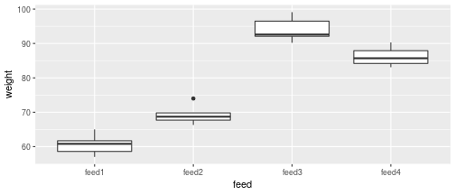

Feed 2 has an outlier, but there are only 5 pigs in each group, and the
conclusion is so clear that I am OK with this.

## Tuberculosis

- The World Health Organization keeps track of number of cases of
various diseases, eg. tuberculosis.
- Some data:


```r
my_url="http://www.utsc.utoronto.ca/~butler/c32/tb.csv"
tb=read_csv(my_url)
```

```
## Parsed with column specification:
## cols(
##   .default = col_double(),
##   iso2 = col_character()
## )
```

```
## See spec(...) for full column specifications.
```

- Variables (see over): country (abbreviated), year. Then number of
cases for each gender and age group, eg. `m1524` is males aged 15–24.
Also `mu` and `fu`, where age is unknown.
- Lots of missings. Want to get rid of.

## The data


```r
glimpse(tb)
```

```
## Observations: 5,769
## Variables: 22
## $ iso2  <chr> "AD", "AD", "AD", "AD", "AD", "AD", "A…
## $ year  <dbl> 1989, 1990, 1991, 1992, 1993, 1994, 19…
## $ m04   <dbl> NA, NA, NA, NA, NA, NA, NA, NA, NA, NA…
## $ m514  <dbl> NA, NA, NA, NA, NA, NA, NA, NA, NA, NA…
## $ m014  <dbl> NA, NA, NA, NA, NA, NA, 0, 0, 0, 0, 0,…
## $ m1524 <dbl> NA, NA, NA, NA, NA, NA, 0, 0, 0, 0, 0,…
## $ m2534 <dbl> NA, NA, NA, NA, NA, NA, 0, 1, 0, 0, 1,…
## $ m3544 <dbl> NA, NA, NA, NA, NA, NA, 4, 2, 1, 1, 0,…
## $ m4554 <dbl> NA, NA, NA, NA, NA, NA, 1, 2, 0, 1, 0,…
## $ m5564 <dbl> NA, NA, NA, NA, NA, NA, 0, 1, 0, 0, 0,…
## $ m65   <dbl> NA, NA, NA, NA, NA, NA, 0, 6, 0, 0, 0,…
## $ mu    <dbl> NA, NA, NA, NA, NA, NA, NA, NA, NA, NA…
## $ f04   <dbl> NA, NA, NA, NA, NA, NA, NA, NA, NA, NA…
## $ f514  <dbl> NA, NA, NA, NA, NA, NA, NA, NA, NA, NA…
## $ f014  <dbl> NA, NA, NA, NA, NA, NA, 0, 0, NA, 0, N…
## $ f1524 <dbl> NA, NA, NA, NA, NA, NA, 1, 1, NA, 0, N…
## $ f2534 <dbl> NA, NA, NA, NA, NA, NA, 1, 2, NA, 0, N…
## $ f3544 <dbl> NA, NA, NA, NA, NA, NA, 0, 3, NA, 1, N…
## $ f4554 <dbl> NA, NA, NA, NA, NA, NA, 0, 0, NA, 0, N…
## $ f5564 <dbl> NA, NA, NA, NA, NA, NA, 1, 0, NA, 0, N…
## $ f65   <dbl> NA, NA, NA, NA, NA, NA, 0, 1, NA, 0, N…
## $ fu    <dbl> NA, NA, NA, NA, NA, NA, NA, NA, NA, NA…
```

## Gather the gender-age group columns


```r
tb %>% gather(genage, freq, m04:fu, na.rm = T) -> tb2
```

- what makes the columns-to-be-gathered different, then
- what makes them the same, then
- the columns to gather, then (optionally)
- get rid of the missing values.

## Results (some)


```r
tb2
```

```
## # A tibble: 35,750 x 4
##    iso2   year genage  freq
##    <chr> <dbl> <chr>  <dbl>
##  1 AD     2005 m04        0
##  2 AD     2006 m04        0
##  3 AD     2008 m04        0
##  4 AE     2006 m04        0
##  5 AE     2007 m04        0
##  6 AE     2008 m04        0
##  7 AG     2007 m04        0
##  8 AL     2005 m04        0
##  9 AL     2006 m04        1
## 10 AL     2007 m04        0
## # … with 35,740 more rows
```

## Separating
- 4 columns, but 5 variables, since `genage` xxx contains both gender and
age group. Split that up using separate.
- `separate` needs 3 things:
  - what to separate (no quotes needed),
  - what to separate into (here you do need quotes),
  - how to split.
- For “how to split”, here “after first character”:

```r
tb2 %>% separate(genage, c("gender", "age"), 1) -> tb3
```

## Tidied tuberculosis data (some)


```r
tb3
```

```
## # A tibble: 35,750 x 5
##    iso2   year gender age    freq
##    <chr> <dbl> <chr>  <chr> <dbl>
##  1 AD     2005 m      04        0
##  2 AD     2006 m      04        0
##  3 AD     2008 m      04        0
##  4 AE     2006 m      04        0
##  5 AE     2007 m      04        0
##  6 AE     2008 m      04        0
##  7 AG     2007 m      04        0
##  8 AL     2005 m      04        0
##  9 AL     2006 m      04        1
## 10 AL     2007 m      04        0
## # … with 35,740 more rows
```

## In practice...

- instead of doing the pipe one step at a time, you *debug* xxx it one step at
a time, and when you have each step working, you use that step’s
output as input to the next step, thus:

```r
tb %>% gather(genage, freq, m04:fu, na.rm = T) %>%
  separate(genage, c("gender", "age"), 1) -> tb3
```

- You can split the R code over as many lines as you like, as long as
each line is incomplete, so that R knows more is to come.
- I like to put the pipe symbol on the end of the line.

## Total tuberculosis cases by year (some of the years)


```r
tb3 %>% group_by(year) %>%
  summarize(cases = sum(freq)) %>%
  filter(between(year, 1990, 1999))
```

```
## # A tibble: 10 x 2
##     year  cases
##    <dbl>  <dbl>
##  1  1990    549
##  2  1991    544
##  3  1992    512
##  4  1993    492
##  5  1994    750
##  6  1995 513971
##  7  1996 635705
##  8  1997 733204
##  9  1998 840389
## 10  1999 994517
```

xxx

- Something very interesting happened between 1994 and 1995.

## Some weather data


```r
my_url="http://www.utsc.utoronto.ca/~butler/c32/weather.csv"
weather=read_csv(my_url)
```

```
## Parsed with column specification:
## cols(
##   .default = col_double(),
##   id = col_character(),
##   element = col_character(),
##   d9 = col_logical(),
##   d12 = col_logical(),
##   d18 = col_logical(),
##   d19 = col_logical(),
##   d20 = col_logical(),
##   d21 = col_logical(),
##   d22 = col_logical(),
##   d24 = col_logical()
## )
```

```
## See spec(...) for full column specifications.
```

## The data (some)


```r
weather
```

```
## # A tibble: 22 x 35
##    id       year month element    d1    d2    d3    d4
##    <chr>   <dbl> <dbl> <chr>   <dbl> <dbl> <dbl> <dbl>
##  1 MX17004  2010     1 tmax       NA  NA    NA      NA
##  2 MX17004  2010     1 tmin       NA  NA    NA      NA
##  3 MX17004  2010     2 tmax       NA  27.3  24.1    NA
##  4 MX17004  2010     2 tmin       NA  14.4  14.4    NA
##  5 MX17004  2010     3 tmax       NA  NA    NA      NA
##  6 MX17004  2010     3 tmin       NA  NA    NA      NA
##  7 MX17004  2010     4 tmax       NA  NA    NA      NA
##  8 MX17004  2010     4 tmin       NA  NA    NA      NA
##  9 MX17004  2010     5 tmax       NA  NA    NA      NA
## 10 MX17004  2010     5 tmin       NA  NA    NA      NA
## # … with 12 more rows, and 27 more variables:
## #   d5 <dbl>, d6 <dbl>, d7 <dbl>, d8 <dbl>, d9 <lgl>,
## #   d10 <dbl>, d11 <dbl>, d12 <lgl>, d13 <dbl>,
## #   d14 <dbl>, d15 <dbl>, d16 <dbl>, d17 <dbl>,
## #   d18 <lgl>, d19 <lgl>, d20 <lgl>, d21 <lgl>,
## #   d22 <lgl>, d23 <dbl>, d24 <lgl>, d25 <dbl>,
## #   d26 <dbl>, d27 <dbl>, d28 <dbl>, d29 <dbl>,
## #   d30 <dbl>, d31 <dbl>
```

## The columns

- Daily weather records for a weather station in Mexico:

  - *id*: identifier for this weather station (always same here)
  - *year*, *month*: obvious 
  - *element*: whether temperature given was daily max or daily min
  - *d1, d2*,...: day of the month from 1st to 31st.

- Numbers in data frame all temperatures (for different days of the month),
so first step is


```r
weather %>% gather(day, temperature, d1:d31, na.rm = T) -> d
```

## So far


```r
d
```

```
## # A tibble: 66 x 6
##    id       year month element day   temperature
##    <chr>   <dbl> <dbl> <chr>   <chr>       <dbl>
##  1 MX17004  2010    12 tmax    d1           29.9
##  2 MX17004  2010    12 tmin    d1           13.8
##  3 MX17004  2010     2 tmax    d2           27.3
##  4 MX17004  2010     2 tmin    d2           14.4
##  5 MX17004  2010    11 tmax    d2           31.3
##  6 MX17004  2010    11 tmin    d2           16.3
##  7 MX17004  2010     2 tmax    d3           24.1
##  8 MX17004  2010     2 tmin    d3           14.4
##  9 MX17004  2010     7 tmax    d3           28.6
## 10 MX17004  2010     7 tmin    d3           17.5
## # … with 56 more rows
```

## The days
- Column `element` xxx contains names of two different variables, that
should each be in separate column.
- Distinct from eg. `m1524` xxx in tuberculosis data, that contained levels of
two different factors, handled by separate.
- Untangling names of variables handled by `spread`:


```r
weather %>%
gather(day,temperature,d1:d31,na.rm=T) %>%
spread(element,temperature) -> d
```

## So far


```r
d
```

```
## # A tibble: 33 x 6
##    id       year month day    tmax  tmin
##    <chr>   <dbl> <dbl> <chr> <dbl> <dbl>
##  1 MX17004  2010     1 d30    27.8  14.5
##  2 MX17004  2010     2 d11    29.7  13.4
##  3 MX17004  2010     2 d2     27.3  14.4
##  4 MX17004  2010     2 d23    29.9  10.7
##  5 MX17004  2010     2 d3     24.1  14.4
##  6 MX17004  2010     3 d10    34.5  16.8
##  7 MX17004  2010     3 d16    31.1  17.6
##  8 MX17004  2010     3 d5     32.1  14.2
##  9 MX17004  2010     4 d27    36.3  16.7
## 10 MX17004  2010     5 d27    33.2  18.2
## # … with 23 more rows
```

## Further improvements
- We have tidy data now, but can improve things further.
- `mutate` creates new columns from old (or assign back to change a
variable).
- Would like the numerical dates. `separate` works, but also produces
column named `d` whose value is always `d`. Instead pull out number as
below.
- `select` keeps columns (or drops, with minus). Station `id` has no
value to us:


```r
weather %>%
  gather(day, temperature, d1:d31, na.rm = T) %>%
  spread(element, temperature) %>%
  mutate(day = parse_number(day)) %>%
  select(-id) -> d
```

## So far


```r
d
```

```
## # A tibble: 33 x 5
##     year month   day  tmax  tmin
##    <dbl> <dbl> <dbl> <dbl> <dbl>
##  1  2010     1    30  27.8  14.5
##  2  2010     2    11  29.7  13.4
##  3  2010     2     2  27.3  14.4
##  4  2010     2    23  29.9  10.7
##  5  2010     2     3  24.1  14.4
##  6  2010     3    10  34.5  16.8
##  7  2010     3    16  31.1  17.6
##  8  2010     3     5  32.1  14.2
##  9  2010     4    27  36.3  16.7
## 10  2010     5    27  33.2  18.2
## # … with 23 more rows
```

## Final step(s)
- Make year-month-day into proper date.
- Keep only date, tmax, tmin:

```r
weather %>%
  gather(day, temperature, d1:d31, na.rm = T) %>%
  spread(element, temperature) %>%
  mutate(day = parse_number(day)) %>%
  select(-id) %>%
  unite(datestr, c(year, month, day), sep = "-") %>%
  mutate(date = as.Date(datestr)) %>%
  select(c(date, tmax, tmin)) -> weather_tidy
```

## Our tidy data frame


```r
weather_tidy
```

```
## # A tibble: 33 x 3
##    date        tmax  tmin
##    <date>     <dbl> <dbl>
##  1 2010-01-30  27.8  14.5
##  2 2010-02-11  29.7  13.4
##  3 2010-02-02  27.3  14.4
##  4 2010-02-23  29.9  10.7
##  5 2010-02-03  24.1  14.4
##  6 2010-03-10  34.5  16.8
##  7 2010-03-16  31.1  17.6
##  8 2010-03-05  32.1  14.2
##  9 2010-04-27  36.3  16.7
## 10 2010-05-27  33.2  18.2
## # … with 23 more rows
```

## Plotting the temperatures
- Plot temperature against date joined by lines, but with separate lines
for max and min.
- ggplot requires something like

```r
ggplot(...,aes(x=date,y=temperature))
```

only we have two temperatures, one a max and one a min, that we
want to keep separate.

- xxx The trick: combine `tmax` and `tmin` together into one column, keeping
track of what kind of temp they are. (This actually same format as
untidy `weather`) Are making `weather_tidy`
untidy for purposes of drawing graph only.
- Then can do something like

```r
ggplot(...,aes(x=date,y=temperature,colour=maxmin)
```

to distinguish max and min on graph.

## Setting up plot
- Since we only need data frame for plot, we can do the
column-creation and plot in a pipeline.
- The temperature columns are actually text (see printout of
`weather_tidy`), but for graph they need to be numbers.
- For a `ggplot` in a pipeline, the initial data frame is omitted, because it
is whatever came out of the previous step.
- To make those “one column”s: `gather`. I save the graph to show overleaf:

```r
weather_tidy %>%
gather(maxmin,temperature,tmax:tmin) %>%
mutate(temperature=as.numeric(temperature)) %>%
ggplot(aes(x=date,y=temperature,colour=maxmin))+
geom_line() -> g
```

## The plot xxx


```r
g
```

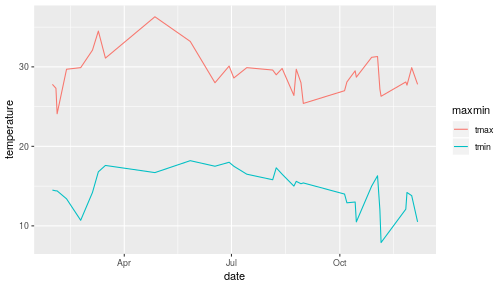

## Summary of tidying “verbs”

  \begin{tabular}{lp{0.7\textwidth}}
    Verb & Purpose\\
    \hline
    \texttt{gather}& Combine columns that measure same thing into one\\
    \texttt{spread}& Take column that measures one thing under
                     different conditions and put into multiple columns\\
    \texttt{separate} & Turn a column that encodes
                        several variables into
                        several columns\\
    \texttt{unite} & Combine several (related) variables into one
                     ``combination'' variable\\
    \hline
  \end{tabular}
  
  \texttt{gather} and \texttt{spread} are opposites; \texttt{separate}
  and \texttt{unite} are opposites.

xxx end for now


# the end of the notes

# template

# The beginning

## R Markdown

This is an R Markdown presentation. Markdown is a simple formatting syntax for authoring HTML, PDF, and MS Word documents. For more details on using R Markdown see <http://rmarkdown.rstudio.com>.

When you click the **Knit** button a document will be generated that includes both content as well as the output of any embedded R code chunks within the document.

## Slide with Bullets

- Bullet 1
- Bullet 2
- Bullet 3

## Slide with R Output


```r
summary(cars)
```

```
##      speed           dist       
##  Min.   : 4.0   Min.   :  2.00  
##  1st Qu.:12.0   1st Qu.: 26.00  
##  Median :15.0   Median : 36.00  
##  Mean   :15.4   Mean   : 42.98  
##  3rd Qu.:19.0   3rd Qu.: 56.00  
##  Max.   :25.0   Max.   :120.00
```

## Slide with Plot


```r
plot(pressure)
```


# the end
